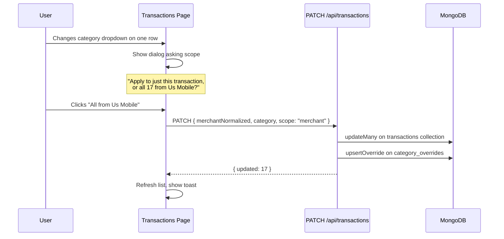

# Bulk Category Propagation + Taxonomy Expansion

## Part 1: Expand the built-in category list

### Analysis of both statements

After scanning all 625 Chase and 649 Discover transactions, there are three clear taxonomy gaps where real spend consistently lands in "Other" or gets miscategorized:

**1. Rent** -- Housing rent payments like `PYL*Campus Living Village` ($725, $669), `RENTTRACK` ($3.70 recurring). These are currently tagged "Professional Services" by Chase. "Home" in our system means Home Depot / Ikea / furnishing -- rent is fundamentally different spend.

**2. Phone/Internet** -- `US MOBILE` ($25/mo recurring on both cards), `COMCAST` ($25). Discover calls these "Services", Chase calls them "Bills & Utilities". Electric/water/gas utilities are distinct from telecom, and the user specifically hit this pain point. Most personal finance apps (Mint, Monarch) separate telecom from utilities.

**3. Government** -- `USCIS ELIS` charges are massive ($2,250, $2,155, $1,685, $470 x2), `FD *CA DMV` ($39). Chase calls these "Bills & Utilities" which is misleading. These are immigration/DMV fees with no existing category fit.

**Not adding (considered but insufficient data):** Fitness (only 2 occurrences of 24 Hour Fitness), Gifts/Donations (zero occurrences), Pet (zero occurrences). These can be added later when real data justifies them.

### New category list (20 total, was 17)

Add after "Home" in the existing ordering:

```
"Rent", "Phone/Internet", "Government"
```

### Files that consume CATEGORIES (all need the new values to flow through)

- [types/index.ts](types/index.ts) -- `CATEGORIES` array and `Category` type (source of truth; change here, derived type updates automatically)
- [lib/services/categorizer.ts](lib/services/categorizer.ts) -- `MERCHANT_RULES` regex array (add new rules for rent, telecom, government merchants)
- [lib/services/categorizer.ts](lib/services/categorizer.ts) -- AI prompt in `categorizeBatchWithAI` (auto-includes from `CATEGORIES.join()`, no change needed)
- [components/upload-review-table.tsx](components/upload-review-table.tsx) -- category dropdown (reads from `CATEGORIES`, no change needed)
- [app/(dashboard)/transactions/page.tsx](app/(dashboard)/transactions/page.tsx) -- filter dropdown (reads from `CATEGORIES`, no change needed)
- [lib/services/category-mapper.ts](lib/services/category-mapper.ts) -- Discover map stays unchanged; Chase map (from the Chase plan) will use the new values
- Dashboard charts, exports -- read dynamically from stored data, no code change needed

So the blast radius is actually small: only `types/index.ts` (add values) and `categorizer.ts` (add regex rules) need editing. Everything else reads from `CATEGORIES` dynamically.

### New regex rules for categorizer.ts

```typescript
{ match: /rent\s*track|campus\s*living|zillow\s*rent|avail\s*rent/i, category: "Rent" },
{ match: /us\s*mobile|t-?mobile|at&?t|verizon|comcast|xfinity|spectrum|cricket|boost\s*mobile|visible/i, category: "Phone/Internet" },
{ match: /uscis|dmv|irs\s|state\s*tax|city\s*tax|passport|immigration/i, category: "Government" },
```

Note: `at&t`, `t-mobile`, `verizon`, `comcast`, `xfinity`, `spectrum` must be **moved** from the existing "Utilities" rule to the new "Phone/Internet" rule. The "Utilities" rule keeps `pg&e`, `water`, `electric`, `gas company`, `utility`.

---

## Part 2: Bulk merchant propagation in upload review

### Current behavior

The `changeCategory` function in [app/(dashboard)/upload/page.tsx](app/(dashboard)/upload/page.tsx) (line 124-133) updates a **single row** by index:

```typescript
function changeCategory(index: number, category: Category) {
  setPreview((prev) => {
    if (!prev) return prev;
    const next = [...prev.transactions];
    next[index] = { ...cur, category, categorizedBy: "user" };
    return { ...prev, transactions: next };
  });
}
```

### New behavior

When the user changes one row, find all rows with the same normalized merchant and update them all:

```typescript
function changeCategory(index: number, category: Category) {
  setPreview((prev) => {
    if (!prev) return prev;
    const target = prev.transactions[index];
    if (!target) return prev;
    const targetKey = normalizeMerchantKey(target.merchant);
    const next = prev.transactions.map((tx, i) => {
      if (i === index) return { ...tx, category, categorizedBy: "user" as const };
      if (targetKey && normalizeMerchantKey(tx.merchant) === targetKey) {
        return { ...tx, category, categorizedBy: "user" as const };
      }
      return tx;
    });
    return { ...prev, transactions: next };
  });
}
```

`normalizeMerchantKey` is already imported in this file (line 28). This change is ~10 lines, zero new dependencies. All 17 "US MOBILE" rows update together when the user corrects one.

A toast should confirm the propagation: `"Updated 17 transactions for Us Mobile"`.

---

## Part 3: Retroactive bulk correction on transactions page

### Current state

The transactions page ([app/(dashboard)/transactions/page.tsx](app/(dashboard)/transactions/page.tsx)) is **read-only**. Users cannot edit categories after upload. The only edit surface is the upload review table.

### New capability

Add inline category editing to the transactions page with a "fix all" option:




### Implementation

**New API endpoint**: Add a `PATCH` handler to [app/api/transactions/route.ts](app/api/transactions/route.ts):

- Accepts `{ transactionId?, merchantNormalized, category, scope: "single" | "merchant" }`
- If `scope === "merchant"`: `updateMany({ userId, merchantNormalized }, { $set: { category, categorizedBy: "user" } })` on the transactions collection, plus `upsertOverride` to save for future uploads
- If `scope === "single"`: update just the one transaction by `_id`
- Returns `{ updated: number }`

**New model function** in [lib/models/transactions.ts](lib/models/transactions.ts):

```typescript
export async function updateCategoryByMerchant(
  userId: string,
  merchantNormalized: string,
  category: Category,
): Promise<number> { ... }
```

**UI changes** to [app/(dashboard)/transactions/page.tsx](app/(dashboard)/transactions/page.tsx):

- Replace the static `Badge` for category with a `Select` dropdown (same pattern as the review table)
- On change, show a small inline prompt or dialog: "Apply to this transaction only" vs "Apply to all [N] transactions from [Merchant]"
- After the PATCH succeeds, refetch the current page to reflect changes

---

## Interaction between Parts 1, 2, and 3

Part 1 (new categories) must land first because Parts 2 and 3 will use them in dropdowns. The `CATEGORIES` array is the single source of truth -- once it includes "Rent", "Phone/Internet", and "Government", every dropdown in the app picks them up automatically. The new regex rules ensure future uploads auto-categorize telecom/rent/government merchants correctly.

Part 2 is a small change to one function. Part 3 is the most work (new API endpoint, model function, UI refactor) but follows established patterns.

---

## Files changed summary


| File                                                                           | Change                                                         |
| ------------------------------------------------------------------------------ | -------------------------------------------------------------- |
| [types/index.ts](types/index.ts)                                               | Add 3 values to `CATEGORIES`                                   |
| [lib/services/categorizer.ts](lib/services/categorizer.ts)                     | Add 3 regex rules, move telecom patterns out of Utilities rule |
| [app/(dashboard)/upload/page.tsx](app/(dashboard)/upload/page.tsx)             | Rewrite `changeCategory` for bulk merchant propagation + toast |
| [app/api/transactions/route.ts](app/api/transactions/route.ts)                 | Add `PATCH` handler for category updates                       |
| [lib/models/transactions.ts](lib/models/transactions.ts)                       | Add `updateCategoryByMerchant()` and `updateCategoryById()`    |
| [app/(dashboard)/transactions/page.tsx](app/(dashboard)/transactions/page.tsx) | Add inline category editing with merchant-scope dialog         |


