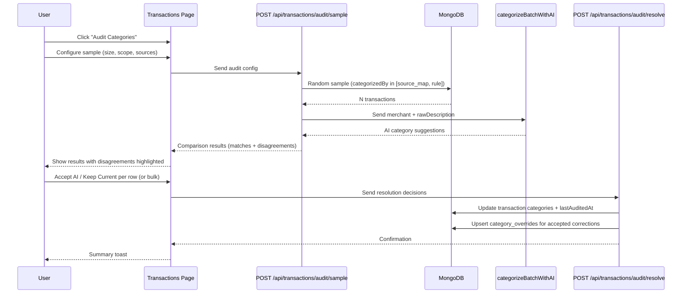

# Category Audit Feature

## Problem

Transactions categorized by `source_map` (Issuer) and `rule` (Regex) are deterministic but not always correct. There is no way to validate their accuracy today. The AI categorizer is only used during upload for uncategorized ("Other") transactions and is never applied as a second opinion on already-categorized transactions.

## Architecture Overview




---

## 1. Schema Changes

### TransactionDoc -- add optional `lastAuditedAt`

In [types/index.ts](types/index.ts), add one optional field to `TransactionDoc`:

```typescript
lastAuditedAt?: Date;
```

This is the re-auditing mechanism. When sampling, we prefer transactions that have **never** been audited. If all eligible transactions have been audited, we fall back to the **least-recently-audited** ones. This means:

- First audits always get fresh, never-seen transactions
- Repeated audits naturally cycle through the full pool over time
- No transaction is permanently excluded -- old audits age out as newer ones take priority
- No new collection needed; minimal schema change

### No new MongoDB collection

We do **not** create a separate `audit_results` collection. The audit results are ephemeral (shown in a dialog, not persisted). What gets persisted:

- Category correction on the `TransactionDoc` (if user accepts AI)
- A `category_overrides` upsert (if user accepts AI, so future uploads learn)
- The `lastAuditedAt` timestamp on every transaction in the sample (whether accepted or kept)

---

## 2. New Constants

In [lib/constants.ts](lib/constants.ts), add:

```typescript
export const AUDIT_SAMPLE_SIZES = [25, 50, 100] as const;
export const AUDIT_DEFAULT_SAMPLE_SIZE = 50;
export const AUDIT_MAX_SAMPLE_SIZE = 100;
```

These govern the dropdown options in the audit config dialog. The max is capped at 100 to keep AI costs predictable (the existing `AI_CATEGORIZE_BATCH_SIZE` is 50, so a sample of 100 will be split into 2 AI calls after merchant deduplication typically brings it well under 100 unique merchants).

---

## 3. New Model Function: `sampleTransactionsForAudit`

In [lib/models/transactions.ts](lib/models/transactions.ts), add a new query function.

**Inputs:**

- `userId` (ObjectId)
- `sampleSize` (number, capped at `AUDIT_MAX_SAMPLE_SIZE`)
- `sources` -- which `categorizedBy` values to audit: `["source_map"]`, `["rule"]`, or `["source_map", "rule"]`
- Optional: `cardType` filter, `category` filter

**Behavior:**

Uses a MongoDB aggregation pipeline:

1. `$match` -- userId, categorizedBy in the requested sources, type is `"debit"` (skip payments/credits since "Payment/Credit" is always correct), category is not "Payment/Credit"
2. `$addFields` -- add a sort key: `{ auditPriority: { $cond: [{ $ifNull: ["$lastAuditedAt", false] }, "$lastAuditedAt", new Date(0)] } }` -- un-audited transactions sort first (epoch = lowest date), then by oldest audit date
3. `$sort` -- `{ auditPriority: 1 }` to prefer un-audited, then least-recently-audited
4. `$sample` within a `$limit` -- actually, `$sample` ignores sort, so the approach is: `$sort` by audit priority, `$limit` to a pool (e.g., 3x sample size), then `$sample` from that pool for randomness within the priority band. This gives us "random among un-audited first, random among stale-audited second."
5. `$project` -- return `_id`, `merchant`, `rawDescription`, `category`, `categorizedBy`, `transactionDate`, `amount`, `cardType`, `sourceCategory`

**Returns:** Array of `TransactionDoc` (the sampled subset).

---

## 4. New API Routes

### `POST /api/transactions/audit/sample`

New file: `app/api/transactions/audit/sample/route.ts`

**Request body:**

```typescript
{
  sampleSize: number;        // 25 | 50 | 100
  sources: ("source_map" | "rule")[];  // which categorization methods to audit
  cardType?: CardType;       // optional filter
  category?: Category;       // optional filter
}
```

**Logic:**

1. Auth check (`getSession()`)
2. Validate inputs (sample size within allowed values, sources non-empty)
3. Call `sampleTransactionsForAudit()` to get the random sample
4. If sample is empty, return `{ results: [], summary: { sampled: 0, matches: 0, disagreements: 0 } }`
5. Build `AIBatchInput[]` from the sample (`merchant` + `rawDescription`)
6. Call `categorizeBatchWithAI(rows)` -- reuses the existing function, which already dedupes by merchant
7. Compare AI suggestion vs. current `category` for each transaction
8. Return results grouped into matches and disagreements:

```typescript
{
  summary: {
    sampled: number;
    matches: number;
    disagreements: number;
    accuracyPct: number;       // matches / sampled * 100
  };
  disagreements: Array<{
    _id: string;
    transactionDate: string;
    merchant: string;
    rawDescription: string;
    amount: number;
    cardType: CardType;
    currentCategory: Category;
    categorizedBy: CategorizationMethod;
    sourceCategory: string | null;
    aiSuggestedCategory: Category;
  }>;
  matches: Array<{
    _id: string;
    merchant: string;
    category: Category;
    categorizedBy: CategorizationMethod;
  }>;
}
```

**AI batch size handling:** If the sample exceeds `AI_CATEGORIZE_BATCH_SIZE` (50) after deduplication, split into batches and call `categorizeBatchWithAI` sequentially. In practice, 100 transactions with merchant deduplication will almost always fit in 1-2 calls.

### `POST /api/transactions/audit/resolve`

New file: `app/api/transactions/audit/resolve/route.ts`

**Request body:**

```typescript
{
  resolutions: Array<{
    transactionId: string;
    action: "accept_ai" | "keep_current";
    aiCategory: Category;       // the AI's suggestion (needed for accept_ai)
    merchant: string;           // needed for override upsert
  }>;
  allTransactionIds: string[];  // every transaction in the sample (for lastAuditedAt)
}
```

**Logic:**

1. Auth check
2. For every `transactionId` in `allTransactionIds`: set `lastAuditedAt = new Date()` via a bulk `updateMany`
3. For each resolution where `action === "accept_ai"`:
  - Update the transaction's `category` to `aiCategory` and `categorizedBy` to `"ai"`
  - Upsert `category_overrides` for that merchant (using `normalizeMerchantKey(merchant)`) with the AI category -- this ensures future uploads of the same merchant get the corrected category automatically
4. Return `{ corrected: number, confirmed: number }`

---

## 5. UI: Transactions Page Changes

All changes in [app/(dashboard)/transactions/page.tsx](app/(dashboard)/transactions/page.tsx).

### 5a. "Audit Categories" button

Add a button in the filter bar area (next to the existing card/category selects). Uses the `ShieldCheck` icon from Lucide. Disabled if `total === 0` (no transactions to audit).

### 5b. Audit Config Dialog

A ShadCN `Dialog` that opens when the button is clicked. Contains:

- **Sample Size** -- Select dropdown with options: 25, 50 (default), 100
- **Sources to Audit** -- Two toggleable badges/checkboxes: "Issuer" (source_map), "Rule" (rule). Both checked by default.
- **Optional Filters** -- Card type and Category selects (mirrors the existing page filters, pre-populated from current filter state if active)
- **"Run Audit" button** -- triggers the API call
- Brief explainer text: "Picks a random sample of transactions and cross-checks their categories with AI. Prioritizes transactions that haven't been audited before."

### 5c. Audit Results View (replaces dialog content)

After the API returns, the dialog content transitions to the results view. This is a larger dialog (or sheet on mobile).

**Summary Card** at the top:

- "Sampled: 50 | Matches: 42 (84%) | Disagreements: 8 (16%)"
- Visual indicator: a simple bar or ring showing agreement percentage

**Disagreements Table** (the main focus):


| Date | Merchant | Current | Source | AI Suggests | Action |
| ---- | -------- | ------- | ------ | ----------- | ------ |


- **Current** -- Badge showing the existing category
- **Source** -- Badge showing "Issuer" or "Rule"
- **AI Suggests** -- Badge showing the AI's suggestion (highlighted/different color)
- **Action** -- Two icon buttons: Accept (CheckCircle2, green) and Keep (X, muted). Clicking either immediately marks the row as resolved with a visual state change (strikethrough or dimmed)

**Bulk Actions** bar above the table:

- "Accept All AI Suggestions" button -- applies AI category to every unresolved disagreement
- "Keep All Current" button -- marks all as confirmed correct
- Counter: "3 of 8 resolved"

**Matches Section** (collapsed by default):

- Expandable section: "42 matches -- categories confirmed correct"
- No action needed; just informational

### 5d. Resolution and Completion

Once the user resolves all disagreements (or clicks a bulk action):

- "Save Results" button becomes active
- On click, calls `POST /api/transactions/audit/resolve` with all decisions
- Shows a toast: "Audit complete: 5 corrected, 3 confirmed"
- Closes the dialog
- Refreshes the transactions list to reflect any category changes

### 5e. State management

The audit flow is self-contained dialog state, not URL-driven. Use `useState` for:

- `auditPhase: "config" | "loading" | "results" | "saving"`
- `auditResults: AuditResponse | null`
- `resolutions: Map<string, "accept_ai" | "keep_current">`

This keeps the audit flow isolated from the main transactions page state.

---

## 6. New Component: `AuditDialog`

To keep the transactions page under 300 lines (per DEVELOPER_GUIDE), extract the audit UI into a new component file:

**New file:** `components/audit-dialog.tsx`

This component receives:

- `open: boolean`
- `onOpenChange: (open: boolean) => void`
- `onComplete: () => void` (to trigger transaction list refresh)
- Current filter state (cardType, category) for pre-populating the config

Internally manages the full audit lifecycle: config -> API call -> results display -> resolution -> save.

---

## 7. Re-Auditing Behavior (Edge Case Handling)

The `lastAuditedAt` approach handles re-auditing gracefully:

- **First audit:** All eligible transactions have `lastAuditedAt = undefined`. The sample is random from the full pool.
- **Second audit:** Previously audited transactions have a `lastAuditedAt` date. The query prefers un-audited transactions first. If the pool has 500 transactions and 50 were audited, the second audit of 50 will draw from the 450 un-audited ones.
- **Pool exhaustion:** Once all eligible transactions have been audited, the query falls back to the least-recently-audited ones. This means re-auditing starts from the oldest audits, which is correct -- rules may have changed since then.
- **New uploads:** Newly imported transactions have no `lastAuditedAt` and are automatically prioritized in the next audit.
- **Category changes:** If a user accepts an AI correction, the transaction's `categorizedBy` changes to `"ai"`. This transaction is no longer eligible for future audits (since we only sample `source_map` and `rule`). This is the correct behavior -- the user has already validated it.

---

## 8. Edge Cases

- **Empty sample:** If the query returns 0 transactions (e.g., all are user_override or AI-categorized), show a message: "No transactions eligible for audit. All transactions are already categorized by AI, manual selection, or saved overrides."
- **AI agrees on everything:** Show a success message: "All 50 sampled transactions match AI expectations. Your rules and issuer mappings look accurate." No disagreement table shown.
- **AI call fails:** Catch the error, show a toast, allow retry. Do not persist `lastAuditedAt` since the audit didn't complete.
- **Partial AI results:** `categorizeBatchWithAI` may return fewer results than sent (if parsing fails for some). Transactions without an AI result are excluded from the disagreement/match counts and not shown in results.
- **Same merchant, different disagreement:** If 5 AMAZON transactions all disagree, they show as 5 separate rows. The user can use "Accept All" to fix them in one click, and the override upsert ensures all future AMAZON transactions get the corrected category. (We considered grouping by merchant, but individual rows are simpler for v1 and the user can already see the pattern.)
- **Dialog closed mid-audit:** If the user closes the dialog during the loading phase, the API call completes server-side but results are discarded. No `lastAuditedAt` is written since resolve was never called. The user can re-run the audit.
- **Concurrent audits:** Not a concern -- the dialog is modal and single-user. The `lastAuditedAt` writes are idempotent.

---

## 9. Files to Create/Modify


| File                                                                           | Action | Purpose                                                                        |
| ------------------------------------------------------------------------------ | ------ | ------------------------------------------------------------------------------ |
| [types/index.ts](types/index.ts)                                               | Modify | Add `lastAuditedAt?: Date` to `TransactionDoc`                                 |
| [lib/constants.ts](lib/constants.ts)                                           | Modify | Add `AUDIT_SAMPLE_SIZES`, `AUDIT_DEFAULT_SAMPLE_SIZE`, `AUDIT_MAX_SAMPLE_SIZE` |
| [lib/models/transactions.ts](lib/models/transactions.ts)                       | Modify | Add `sampleTransactionsForAudit()` function                                    |
| `app/api/transactions/audit/sample/route.ts`                                   | Create | Sample + AI comparison endpoint                                                |
| `app/api/transactions/audit/resolve/route.ts`                                  | Create | Apply resolutions + persist `lastAuditedAt`                                    |
| `components/audit-dialog.tsx`                                                  | Create | Full audit dialog component                                                    |
| [app/(dashboard)/transactions/page.tsx](app/(dashboard)/transactions/page.tsx) | Modify | Add "Audit Categories" button + wire up `AuditDialog`                          |
| [DEVELOPER_GUIDE.md](DEVELOPER_GUIDE.md)                                       | Modify | Update project structure tree with new files                                   |


