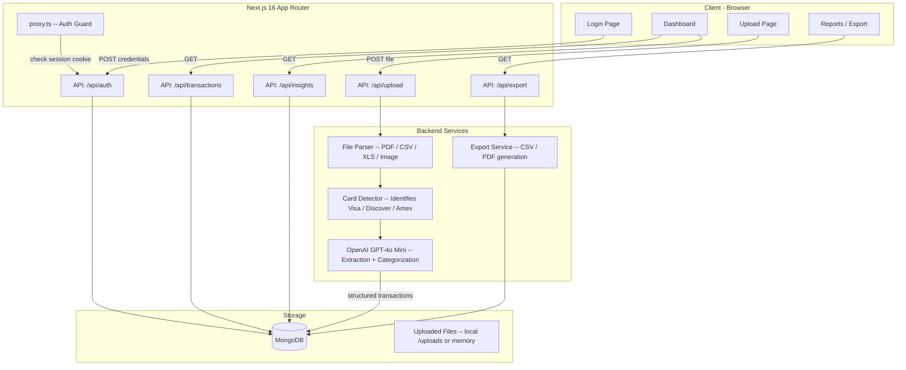
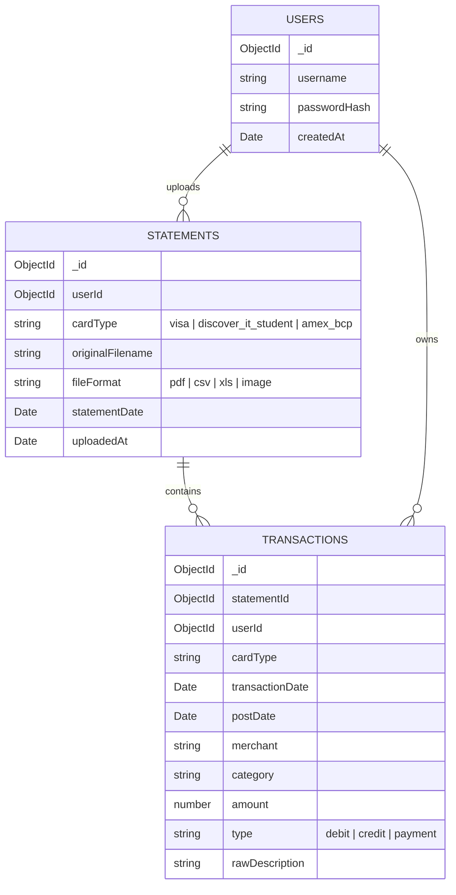

# Credit Spend Analyser -- Implementation Plan

## Architecture Overview

## Data Model

---

## Phase 1: Project Foundation and ShadCN Setup

**Goal:** Set up ShadCN UI, configure the design system, and establish the project structure.

**Steps:**

- Install ShadCN UI via `npx shadcn@latest init` (select default theme, CSS variables, New York style)
- Install core ShadCN components: `button`, `card`, `input`, `label`, `table`, `dialog`, `dropdown-menu`, `sidebar`, `sheet`, `tabs`, `badge`, `separator`, `avatar`, `toast`, `chart`, `skeleton`, `select`, `tooltip`
- Create the folder structure:
  - `app/(auth)/login/page.tsx` -- login page (public)
  - `app/(dashboard)/layout.tsx` -- sidebar shell for all authenticated pages
  - `app/(dashboard)/page.tsx` -- main dashboard
  - `app/(dashboard)/upload/page.tsx` -- upload statements
  - `app/(dashboard)/transactions/page.tsx` -- transaction list
  - `app/(dashboard)/reports/page.tsx` -- reports and export
  - `app/api/auth/route.ts` -- login/logout endpoints
  - `app/api/upload/route.ts` -- file upload endpoint
  - `app/api/transactions/route.ts` -- CRUD transactions
  - `app/api/insights/route.ts` -- aggregated insights
  - `app/api/export/route.ts` -- export endpoint
  - `lib/db.ts` -- MongoDB connection singleton
  - `lib/openai.ts` -- OpenAI client
  - `lib/parsers/` -- file format parsers
  - `lib/services/` -- card detection, extraction, categorization
  - `types/` -- TypeScript interfaces
- Create `.env.local` template with `MONGODB_URI`, `OPENAI_API_KEY`, `AUTH_SECRET` placeholders
- Update [app/layout.tsx](app/layout.tsx) metadata to "Credit Spend Analyser"

---

## Phase 2: MongoDB Integration and Authentication

**Goal:** Connect to MongoDB, set up user model, build login flow.

**Steps:**

- Install `mongodb` package (native driver -- lighter than Mongoose for this use case)
- Create `lib/db.ts` -- singleton MongoDB client with connection caching (avoids reconnect on every request in dev)
- Create `lib/models/` with collection helpers:
  - `users.ts` -- `findUserByUsername()`, `createUser()`, `validatePassword()`
  - `statements.ts` -- `insertStatement()`, `getStatements()`, `getStatementById()`
  - `transactions.ts` -- `insertTransactions()`, `getTransactions()`, `getTransactionsByUser()`, aggregation pipelines for insights
- Install `bcryptjs` for password hashing
- Create `scripts/seed-user.ts` -- CLI script to insert a user into MongoDB:
  - Usage: `npx tsx scripts/seed-user.ts --username admin --password yourpassword`
  - Hashes password with bcrypt, inserts into `users` collection
- Build `app/api/auth/route.ts`:
  - `POST` -- accepts `{ username, password }`, validates against MongoDB, sets an HTTP-only secure cookie (JWT or signed session token)
  - `DELETE` -- clears the cookie (logout)
- Install `jose` for JWT signing/verification (lightweight, Edge-compatible)
- Create `lib/auth.ts` -- `signToken()`, `verifyToken()`, `getSession()` helpers
- Build `proxy.ts` at project root (Next.js 16 replaces middleware with proxy):
  - Check for valid session cookie on all `/(dashboard)` routes
  - Redirect to `/login` if unauthenticated
  - Allow `/login`, `/api/auth`, and static assets through
- Build `app/(auth)/login/page.tsx`:
  - ShadCN Card with username + password inputs and login button
  - Client-side form submission to `/api/auth`
  - Error display on invalid credentials
  - Redirect to dashboard on success

---

## Phase 3: File Upload Infrastructure

**Goal:** Build the upload pipeline that accepts PDF, CSV, XLS, and image files.

**Steps:**

- Install parsing libraries:
  - `pdf-parse` -- PDF text extraction
  - `xlsx` -- Excel and CSV parsing
  - No special library needed for images (sent directly to OpenAI vision)
- Create `lib/parsers/pdf-parser.ts` -- extract raw text from PDF buffers
- Create `lib/parsers/csv-parser.ts` -- parse CSV into row arrays using `xlsx` (it handles CSV too)
- Create `lib/parsers/xls-parser.ts` -- parse XLS/XLSX into row arrays
- Create `lib/parsers/image-parser.ts` -- convert image to base64 for OpenAI vision API
- Create `lib/parsers/index.ts` -- unified `parseFile(buffer, mimeType)` that routes to the correct parser
- Build `app/api/upload/route.ts`:
  - Accept `multipart/form-data` with file upload
  - Validate file type (PDF, CSV, XLS/XLSX, JPG/PNG)
  - Validate file size (cap at 20MB)
  - Pass raw buffer to parser pipeline
  - Return extracted transaction data and card type
  - Save statement + transactions to MongoDB
- Build `app/(dashboard)/upload/page.tsx`:
  - Drag-and-drop zone (with click-to-browse fallback)
  - File type indicator icons
  - Upload progress bar
  - Preview of detected card type and extracted transactions before confirming save
  - Success/error toast notifications

---

## Phase 4: OpenAI Extraction and Card Detection

**Goal:** Use GPT-4o Mini to extract structured transaction data and auto-detect card type.

**Steps:**

- Install `openai` npm package
- Create `lib/openai.ts` -- OpenAI client singleton configured with API key from env
- Create `lib/services/card-detector.ts`:
  - Analyzes raw text/data for card-specific markers:
    - **Visa:** look for "Visa", card number pattern, statement layout cues
    - **Discover IT Student:** look for "Discover", "Cashback Bonus", student card markers
    - **Amex BCP:** look for "American Express", "Blue Cash Preferred", membership number format
  - First pass: regex/keyword-based detection (fast, no API cost)
  - Fallback: ask GPT-4o Mini to identify the card if keywords are ambiguous
- Create `lib/services/extractor.ts`:
  - Build tailored prompts for each card type (Visa, Discover, Amex BCP have different statement layouts)
  - For **text-based** input (PDF/CSV/XLS parsed text):
    - Send text to GPT-4o Mini with a structured extraction prompt
    - Request JSON output with: `transactionDate`, `postDate`, `description`, `merchant`, `amount`, `type`
  - For **image** input:
    - Use GPT-4o Mini's vision capability
    - Send base64 image with extraction prompt
    - Same structured JSON output
  - Validate and sanitize GPT output (handle hallucinations, missing fields)
- Create `lib/services/categorizer.ts`:
  - Category list: Groceries, Dining, Gas/Fuel, Entertainment, Shopping, Travel, Subscriptions, Utilities, Healthcare, Insurance, Education, Personal Care, Home, Transportation, Fees/Interest, Payment/Credit, Other
  - Two-phase approach:
    1. Rule-based matching first (known merchants like "WALMART" -> Groceries, "NETFLIX" -> Subscriptions)
    2. GPT-4o Mini for ambiguous merchants (batch categorization to minimize API calls)
- Create `lib/services/extraction-pipeline.ts` -- orchestrates the full flow:
  1. Parse file -> raw content
  2. Detect card type
  3. Extract transactions via GPT-4o Mini
  4. Categorize transactions
  5. Store in MongoDB
  6. Return results

---

## Phase 5: Dashboard and Spending Insights

**Goal:** Build the main dashboard with charts and spending breakdowns.

**Steps:**

- ShadCN includes Recharts-based `chart` components -- use those for all visualizations
- Build `app/api/insights/route.ts`:
  - MongoDB aggregation pipelines for:
    - Total spend by category (current month, last 3 months, custom range)
    - Monthly spend trend (last 12 months)
    - Spend by card type
    - Top 10 merchants by total spend
    - Month-over-month change percentage
    - Average transaction size by category
- Build `app/(dashboard)/page.tsx` -- main dashboard with:
  - **Summary cards** at top: Total Spend (this month), Number of Transactions, Top Category, Month-over-Month change
  - **Spending by Category** -- donut/pie chart with category breakdown
  - **Monthly Trend** -- bar or area chart showing spend over last 12 months
  - **Card Comparison** -- grouped bar chart comparing Visa vs Discover vs Amex
  - **Top Merchants** -- horizontal bar chart of top 10 merchants
  - **Recent Transactions** -- compact table showing last 10 transactions
  - Date range filter (this month, last 3 months, last 6 months, last year, custom)
  - Card type filter (All, Visa, Discover, Amex)
- Build `app/(dashboard)/transactions/page.tsx`:
  - Full searchable, sortable, paginated transaction table
  - Filters: date range, card type, category, amount range
  - Inline category badge with color coding
  - Click to expand transaction details

---

## Phase 6: Reports and Export

**Goal:** Build the reports page with filterable views and export functionality.

**Steps:**

- Build `app/api/export/route.ts`:
  - `GET ?format=csv` -- generate CSV of filtered transactions
  - `GET ?format=pdf` -- generate PDF report with summary + transaction table (use a library like `jspdf` + `jspdf-autotable` or server-side HTML-to-PDF)
  - Query parameters for filters: `startDate`, `endDate`, `cardType`, `category`
- Build `app/(dashboard)/reports/page.tsx`:
  - **Report Builder** UI:
    - Select date range
    - Select card(s)
    - Select categories
    - Preview summary stats for the selection
  - **Export buttons**: "Export as CSV", "Export as PDF"
  - **Statement History** section:
    - Table of all uploaded statements
    - Card type, upload date, number of transactions, total amount
    - Option to re-view extracted data from any statement

---

## Phase 7: Sidebar Navigation and Layout Polish

**Goal:** Build the sidebar shell and finalize the UI.

**Steps:**

- Build `app/(dashboard)/layout.tsx` with ShadCN Sidebar:
  - **Logo/Brand** at top
  - **Navigation items**: Dashboard (home icon), Upload (upload icon), Transactions (list icon), Reports (file-text icon)
  - **User section** at bottom: username display, logout button
  - Collapsible sidebar (icon-only mode on mobile/small screens)
  - Active state highlighting on current route
- Install `lucide-react` for icons (ShadCN's default icon set)
- Add loading states (`loading.tsx`) for each route segment with Skeleton components
- Add error boundaries (`error.tsx`) for graceful error handling
- Responsive design: sidebar collapses to sheet/drawer on mobile
- Dark mode support via ShadCN's theme toggle (CSS variables already in place from Tailwind v4 setup)
- Toast notifications for all user actions (upload success, export ready, errors)

---

## Phase 8: Testing, Polish, and Hardening

**Goal:** Final polish, edge cases, and production readiness.

**Steps:**

- Handle edge cases in parsing:
  - Statements with no transactions
  - Partial/corrupted files
  - Password-protected PDFs (show clear error)
  - Very large files (streaming/chunking)
- Add proper error messages throughout the UI
- Add optimistic UI updates where appropriate
- Ensure all API routes validate input and return proper HTTP status codes
- Add rate limiting on upload endpoint
- Ensure sensitive data (API keys, connection strings) never leak to client
- Final responsive pass on all pages
- Test with real statements from each card type

---

## Key Files Reference

| File                                    | Purpose                                                 |
| --------------------------------------- | ------------------------------------------------------- |
| `proxy.ts`                              | Auth guard (Next.js 16 convention, replaces middleware) |
| `lib/db.ts`                             | MongoDB connection singleton                            |
| `lib/openai.ts`                         | OpenAI client singleton                                 |
| `lib/auth.ts`                           | JWT sign/verify/session helpers                         |
| `lib/parsers/`                          | PDF, CSV, XLS, Image parsers                            |
| `lib/services/card-detector.ts`         | Auto-detect card type from statement                    |
| `lib/services/extractor.ts`             | GPT-4o Mini extraction prompts                          |
| `lib/services/categorizer.ts`           | Transaction categorization                              |
| `lib/services/extraction-pipeline.ts`   | Orchestrates full upload flow                           |
| `scripts/seed-user.ts`                  | CLI to create user in MongoDB                           |
| `app/(auth)/login/page.tsx`             | Login page                                              |
| `app/(dashboard)/layout.tsx`            | Sidebar + auth shell                                    |
| `app/(dashboard)/page.tsx`              | Main dashboard                                          |
| `app/(dashboard)/upload/page.tsx`       | Upload statements                                       |
| `app/(dashboard)/transactions/page.tsx` | Transaction list                                        |
| `app/(dashboard)/reports/page.tsx`      | Reports + export                                        |

## NPM Packages to Install

- `mongodb` -- native MongoDB driver
- `openai` -- OpenAI SDK
- `bcryptjs` -- password hashing
- `jose` -- JWT tokens (lightweight)
- `pdf-parse` -- PDF text extraction
- `xlsx` -- CSV and Excel parsing
- `lucide-react` -- icons
- `recharts` -- charts (installed with ShadCN chart component)
- `jspdf` + `jspdf-autotable` -- PDF report generation
- `@types/bcryptjs` -- TypeScript types

