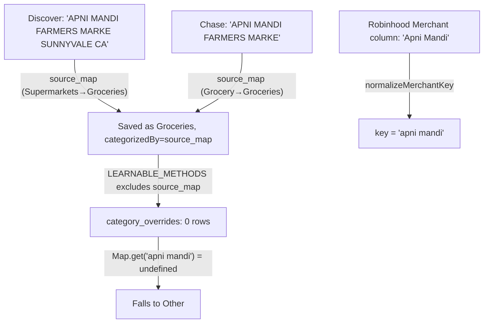

# Fix Transaction Learning Pipeline

## Root causes recap



## Fix 1 — [`lib/services/extraction-pipeline.ts`](lib/services/extraction-pipeline.ts) (line 274)

Add `"source_map"` to `LEARNABLE_METHODS`:

```typescript
// Before
const LEARNABLE_METHODS: CategorizationMethod[] = ["user", "ai"];

// After
const LEARNABLE_METHODS: CategorizationMethod[] = ["user", "ai", "source_map"];
```

This causes every confirmed `source_map` transaction (e.g. all Discover/Chase Apni Mandi rows) to write their normalized merchant key + category into `category_overrides` going forward. User-manual overrides are safe: if a merchant is in the override map at upload time, it categorizes as `user_override` (not `source_map`), so Fix 1 never overwrites user corrections.

## Fix 2 — [`lib/services/categorizer.ts`](lib/services/categorizer.ts) (lines 100–106)

Add a word-boundary prefix fallback after the exact `Map.get()` miss:

```typescript
if (overrideMap && overrideMap.size > 0) {
  const key = normalizeMerchantKey(tx.merchant ?? tx.rawDescription ?? "");
  if (key) {
    const hit = overrideMap.get(key);
    if (hit) return { ...tx, category: hit, categorizedBy: "user_override" };

    // Prefix fallback: match on word boundary so "apni mandi" hits
    // "apni mandi farmers marke sunnyvale" without risking "shell" → "shellfish"
    for (const [storedKey, storedCategory] of overrideMap) {
      if (
        storedKey.startsWith(key + " ") ||
        key.startsWith(storedKey + " ")
      ) {
        return { ...tx, category: storedCategory, categorizedBy: "user_override" };
      }
    }
  }
}
```

The `+ " "` guard ensures matching only at word boundaries (prevents `"shell"` matching `"shellfish"`). Performance is O(n) per debit transaction on the override map — acceptable for a personal finance app where the map has at most hundreds of entries.

## Files changed

- [`lib/services/extraction-pipeline.ts`](lib/services/extraction-pipeline.ts) — 1 line
- [`lib/services/categorizer.ts`](lib/services/categorizer.ts) — ~6 lines added
