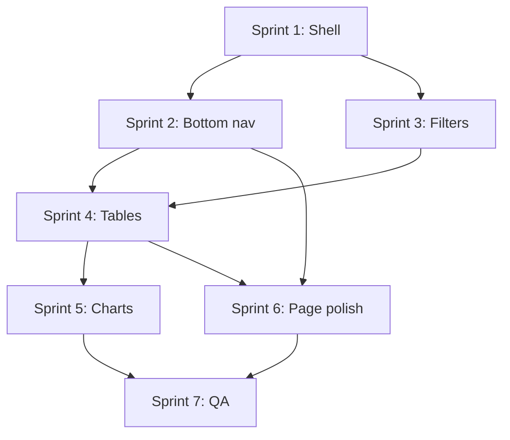

# Mobile Optimization Plan

## Goal

Deliver a phone-first experience without rewriting the app: thumb-reachable navigation, no horizontal page scroll (except intentional data scroll regions), readable typography, and touch-friendly controls — while keeping the existing desktop layout unchanged above `md` (768px).

## Current state (baseline)

| Area | Today | Mobile gap |
|------|-------|------------|
| **Shell** | `SidebarProvider` + `AppSidebar` in [`app/(dashboard)/layout.tsx`](app/(dashboard)/layout.tsx) | Sidebar opens as a left Sheet via hamburger only; no persistent nav |
| **Breakpoint** | `MOBILE_BREAKPOINT = 768` in [`lib/constants.ts`](lib/constants.ts), [`hooks/use-mobile.ts`](hooks/use-mobile.ts) | Hook exists but is barely used outside ShadCN sidebar |
| **Sidebar** | ShadCN [`components/ui/sidebar.tsx`](components/ui/sidebar.tsx) already renders Sheet on mobile | 7 nav items hidden behind hamburger — too many taps for common flows |
| **Header** | Fixed `h-14` bar with generic title | No per-page title; hamburger competes with content for attention |
| **Grids** | Most pages use `md:` / `lg:` responsive grids | Summary cards (`grid-cols-3` on transactions) and filter rows use fixed widths |
| **Tables** | Transactions, uploads, reports, dashboard recent tx, upload review | Wide tables overflow viewport; some columns already hidden at `lg:` only |
| **Charts** | Recharts in [`components/insight-charts.tsx`](components/insight-charts.tsx) | Pie legend + bar labels can clip on narrow screens |
| **Coverage** | Horizontal month timeline in [`components/coverage-timeline.tsx`](components/coverage-timeline.tsx) | Needs explicit horizontal scroll container + sticky labels |
| **Login** | Centered card in [`app/(auth)/login/page.tsx`](app/(auth)/login/page.tsx) | Already acceptable; minor safe-area padding only |
| **Toasts** | Sonner `position="top-right"` in [`app/layout.tsx`](app/layout.tsx) | Can overlap mobile header / notch |

**Design principle:** Mobile adds layout; desktop stays the same. Prefer Tailwind responsive classes and small shared components over page-by-page one-offs.

---

## Information architecture (mobile nav)

Seven routes today in [`components/app-sidebar.tsx`](components/app-sidebar.tsx):

| Route | Label | Mobile tier |
|-------|-------|-------------|
| `/` | Dashboard | **Primary** (bottom nav) |
| `/upload` | Upload | **Primary** (bottom nav) |
| `/transactions` | Transactions | **Primary** (bottom nav) |
| `/recurring` | Recurring | **Secondary** (More sheet) |
| `/uploads` | Uploads | **Secondary** (More sheet) |
| `/reports` | Reports | **Secondary** (More sheet) |
| `/coverage` | Coverage | **Secondary** (More sheet) |

**Bottom nav (4 items):** Dashboard · Upload · Transactions · More

**More sheet:** Recurring, Uploads, Reports, Coverage, username, Sign out (mirrors sidebar footer).

Desktop: unchanged left sidebar (collapsible icon mode).

---

## Shared components to introduce

| Component | Purpose | Used by |
|-----------|---------|---------|
| `components/mobile-bottom-nav.tsx` | Fixed bottom tab bar + active route | Dashboard layout |
| `components/mobile-more-sheet.tsx` | Secondary routes + account actions | Bottom nav "More" tab |
| `components/mobile-page-header.tsx` | Title, optional action slot, back if needed | Dashboard layout (replaces generic header text on mobile) |
| `components/mobile-filter-bar.tsx` | Collapsible "Filters" trigger → full-width controls | Dashboard, transactions, reports |
| `components/transaction-row-card.tsx` | Card layout for one transaction | Transactions page (mobile) |
| `components/responsive-data-table.tsx` | Wrapper: `Table` on `md+`, slot for card list below | Uploads, reports, upload review |

Keep [`components/app-sidebar.tsx`](components/app-sidebar.tsx) as the single source of truth for `NAV` items — export the array and split into primary/secondary in the new mobile nav.

---

## Sprint 1 — Mobile shell foundation

**Objective:** Fix the page frame so later sprints have a stable canvas.

### Tasks

1. **Viewport & safe areas**
   - Add `viewport` export in [`app/layout.tsx`](app/layout.tsx): `width=device-width`, `initialScale=1`, `viewportFit=cover`.
   - Add CSS utilities in [`app/globals.css`](app/globals.css):
     - `--bottom-nav-height: 4rem` (placeholder for Sprint 2)
     - `.pb-safe` / `.pt-safe` using `env(safe-area-inset-*)`
   - Ensure `body` / dashboard shell use `min-h-dvh` (not just `min-h-screen`) for correct mobile browser chrome.

2. **Dashboard layout scroll model**
   - In [`app/(dashboard)/layout.tsx`](app/(dashboard)/layout.tsx):
     - `SidebarInset`: `flex flex-col min-h-dvh`
     - `main`: `flex-1 overflow-y-auto overscroll-y-contain` with `pb-[calc(var(--bottom-nav-height)+env(safe-area-inset-bottom))]` on mobile (padding reserved even before bottom nav lands).
     - Reduce mobile horizontal padding: `p-4 md:p-6` (already partially there).

3. **Mobile-aware header**
   - Create `MobilePageHeader` (client): reads pathname → page title map; shows title centered or left-aligned; keeps `SidebarTrigger` as overflow menu on `md+` only OR keep trigger but hide redundant app name on mobile.
   - On mobile: show **page title** instead of "Credit Spend Analyser".

4. **Toast placement**
   - Client wrapper or conditional: `position="bottom-center"` when `useIsMobile()`, `top-right` on desktop — avoids notch overlap.

### Acceptance criteria

- [ ] No double scrollbars on dashboard pages
- [ ] Content not hidden behind iOS home indicator (padding visible)
- [ ] Header shows contextual page title on viewports &lt; 768px
- [ ] Login page still centers correctly

### Files touched

`app/layout.tsx`, `app/globals.css`, `app/(dashboard)/layout.tsx`, new `components/mobile-page-header.tsx`, optional `components/mobile-toaster.tsx`

---

## Sprint 2 — Bottom navigation + More sheet

**Objective:** Primary routes reachable in one thumb tap; secondary routes one tap away via More.

### Tasks

1. **Extract shared nav config**
   - Move `NAV` from `app-sidebar.tsx` to e.g. `lib/nav.ts`:
     ```ts
     export const PRIMARY_NAV = ["/", "/upload", "/transactions"] as const;
     export const NAV_ITEMS = [ ... ]; // full list with href, label, icon
     ```
   - `AppSidebar` imports from `lib/nav.ts`.

2. **`MobileBottomNav`**
   - Fixed `bottom-0 inset-x-0 z-40`, `border-t`, `bg-background/95 backdrop-blur`
   - Height `var(--bottom-nav-height)`; `pb-[env(safe-area-inset-bottom)]`
   - Icons + short labels (10–11px)
   - Active state: `pathname === href` or `pathname.startsWith(href)` for nested routes
   - **More** tab opens sheet (does not navigate)

3. **`MobileMoreSheet`**
   - Lists secondary nav items + separator + username + sign out (reuse logout logic from sidebar)
   - Closes on link click

4. **Sidebar behavior on mobile**
   - Option A (recommended): Hide `SidebarTrigger` on mobile; bottom nav replaces it.
   - Option B: Keep hamburger for users who expect drawer — redundant with More sheet; avoid unless user testing says otherwise.

5. **Wire into layout**
   - Render `MobileBottomNav` inside `SidebarProvider`, only when mobile (`md:hidden` wrapper with client component).

### Acceptance criteria

- [ ] Dashboard, Upload, Transactions reachable without opening a drawer
- [ ] Recurring / Uploads / Reports / Coverage reachable via More in ≤2 taps
- [ ] Active tab visually indicated
- [ ] Desktop sidebar unchanged

### Files touched

`lib/nav.ts`, `components/app-sidebar.tsx`, `components/mobile-bottom-nav.tsx`, `components/mobile-more-sheet.tsx`, `app/(dashboard)/layout.tsx`

---

## Sprint 3 — Shared mobile filter patterns

**Objective:** Filter bars stop breaking layout on narrow screens.

### Tasks

1. **`MobileFilterBar` component**
   - Desktop: render children inline (current behavior).
   - Mobile: collapsed row — "Filters" button + active filter count badge; opens [`Sheet`](components/ui/sheet.tsx) side=bottom with full-width controls stacked vertically.
   - Optional: show 1–2 "quick chips" (e.g. current date range) outside the sheet.

2. **Dashboard filters** — [`components/dashboard-filters.tsx`](components/dashboard-filters.tsx)
   - Replace fixed `w-[160px]` / `w-[200px]` with `w-full sm:w-[160px]`.
   - Wrap in `MobileFilterBar` on dashboard page header area.

3. **Transactions filters** — [`app/(dashboard)/transactions/page.tsx`](app/(dashboard)/transactions/page.tsx)
   - Search input: `w-full` on mobile
   - Move date range + card + category selects into filter sheet on mobile
   - "Audit Categories" becomes full-width button below filters or in sheet footer

4. **Reports filters** — [`app/(dashboard)/reports/page.tsx`](app/(dashboard)/reports/page.tsx)
   - Same pattern as dashboard (URL-driven filters)

5. **Page titles on mobile**
   - Stack title + filters vertically: `flex-col gap-3 sm:flex-row sm:items-center sm:justify-between`

### Acceptance criteria

- [ ] No filter control forces horizontal page scroll at 375px width
- [ ] Custom date range usable on mobile (native date inputs full width)
- [ ] Filter state still URL-driven (no regression)

### Files touched

`components/mobile-filter-bar.tsx`, `components/dashboard-filters.tsx`, `app/(dashboard)/transactions/page.tsx`, `app/(dashboard)/reports/page.tsx`, `app/(dashboard)/page.tsx`

---

## Sprint 4 — Tables → cards / responsive data views

**Objective:** Data-heavy pages readable without pinch-zoom.

### Strategy

| Pattern | When |
|---------|------|
| **Horizontal scroll region** | Simple read-only tables (uploads history, reports statement list) — wrap in `overflow-x-auto -mx-4 px-4` with shadow fade hint |
| **Card list** | Interactive rows (transactions, upload review) — one card per row with primary info visible, secondary in muted text |

### Tasks

1. **Transactions page** (highest priority)
   - Summary cards: `grid-cols-1 xs:grid-cols-3` or `grid-cols-1 sm:grid-cols-3` — stack on phone
   - Mobile: render `TransactionRowCard` list instead of `Table`
   - Card shows: merchant, amount (right-aligned), date, category badge, card badge; tap category opens existing edit flow
   - Desktop: keep table

2. **Upload review** — [`components/upload-review-table.tsx`](components/upload-review-table.tsx)
   - Mobile card: date, merchant, amount, category select (full width)
   - Hide description column on mobile (already hidden until `lg:` — surface in expandable row or secondary line)

3. **Uploads page** — [`app/(dashboard)/uploads/page.tsx`](app/(dashboard)/uploads/page.tsx)
   - Wrap table in scroll container OR compact card: filename, date, tx count, delete action

4. **Reports page** — statement history table
   - Scroll container + prioritize columns: hide "Uploaded" on mobile, show filename + spend

5. **Dashboard recent transactions** — [`app/(dashboard)/page.tsx`](app/(dashboard)/page.tsx)
   - Same card pattern as transactions (reuse component) or simplified 3-field row

### Acceptance criteria

- [ ] Transactions usable at 320px width
- [ ] Category edit still works on mobile
- [ ] Pagination controls full width, min 44px tap targets

### Files touched

`components/transaction-row-card.tsx`, `components/upload-review-table.tsx`, `app/(dashboard)/transactions/page.tsx`, `app/(dashboard)/uploads/page.tsx`, `app/(dashboard)/reports/page.tsx`, `app/(dashboard)/page.tsx`

---

## Sprint 5 — Charts and dashboard grids

**Objective:** Insights legible on small screens without sacrificing desktop density.

### Tasks

1. **Chart container sizing** — [`components/insight-charts.tsx`](components/insight-charts.tsx)
   - Category pie: `max-h-[240px]` on mobile, `max-h-[280px]` on md+; reduce `outerRadius` on narrow screens (hook or CSS container query)
   - Bar charts: increase bottom margin for rotated X labels on mobile (`angle={-45}` only when width &lt; 400)
   - Top merchants / card comparison: reduce `YAxis` width or truncate merchant names with tooltip

2. **Legend overflow**
   - Pie legend: switch to vertical stack below chart on mobile (`flex-col` in `ChartLegendContent` wrapper)
   - Consider top-N + "Other" on mobile if &gt;6 categories crowd legend

3. **Dashboard summary cards** — already `md:grid-cols-2 lg:grid-cols-4`
   - Verify single column on mobile with comfortable padding
   - MoM percentage text doesn't wrap awkwardly

4. **Chart cards**
   - Card headers: `text-base` on mobile, `text-lg` on md+
   - Ensure chart cards don't use fixed heights that clip tooltips

### Acceptance criteria

- [ ] All four dashboard charts render without clipping at 375px
- [ ] Tooltips tappable / readable on touch devices
- [ ] No horizontal scroll introduced by charts

### Files touched

`components/insight-charts.tsx`, `app/(dashboard)/page.tsx`, optional `hooks/use-container-width.ts`

---

## Sprint 6 — Page-specific polish

**Objective:** Remaining routes and overlays feel native on phone.

### Tasks

1. **Coverage** — [`components/coverage-timeline.tsx`](components/coverage-timeline.tsx), [`components/coverage-card-panel.tsx`](components/coverage-card-panel.tsx)
   - Timeline: outer `overflow-x-auto` with `scroll-snap-x` month columns; min-height for touch targets on month cells
   - Sticky year selector row while scrolling cards vertically
   - "Add card" form: stack fields vertically (`flex-col gap-3`)

2. **Recurring** — [`app/(dashboard)/recurring/page.tsx`](app/(dashboard)/recurring/page.tsx)
   - Alert banners: full width, don't squash action buttons — stack button below text on mobile
   - [`components/recurring-items-table.tsx`](components/recurring-items-table.tsx): card layout or horizontal scroll

3. **Upload wizard** — [`app/(dashboard)/upload/page.tsx`](app/(dashboard)/upload/page.tsx)
   - Drop zone: reduce `p-10` → `p-6` on mobile
   - Step action buttons: sticky footer bar (`fixed bottom-[var(--bottom-nav-height)]`) for "Save" / "Run AI" during review step — avoids scrolling to find primary CTA
   - File input remains accessible (not just click-on-dropzone)

4. **Dialogs** — audit, recurring override, add recurring
   - Mobile: `DialogContent` → near full-screen (`max-w-[calc(100%-1rem)] max-h-[90dvh]`) — partially exists
   - Footer buttons: full-width stacked (`flex-col-reverse gap-2`)

5. **Hide desktop-only chrome**
   - Sidebar trigger hidden on mobile (if Sprint 2 Option A)
   - Collapsed sidebar cookie state irrelevant on mobile

### Acceptance criteria

- [ ] Coverage timeline scrolls horizontally with visible affordance (fade edge)
- [ ] Upload review "Save transactions" always reachable
- [ ] Audit dialog usable without zoom

### Files touched

`components/coverage-timeline.tsx`, `components/coverage-card-panel.tsx`, `app/(dashboard)/coverage/page.tsx`, `app/(dashboard)/recurring/page.tsx`, `components/recurring-items-table.tsx`, `app/(dashboard)/upload/page.tsx`, `components/audit-dialog.tsx`, related dialogs

---

## Sprint 7 — QA, accessibility, documentation

**Objective:** Ship confidence — test matrix, touch targets, docs.

### Tasks

1. **Manual test matrix**

   | Device / width | Pages to smoke-test |
   |----------------|---------------------|
   | iPhone SE (375) | All routes + upload flow end-to-end |
   | iPhone 14 Pro (393 + notch) | Safe areas, toast, bottom nav |
   | Android Chrome (360) | Same |
   | iPad (768 boundary) | Sidebar appears, bottom nav hidden |

2. **Touch targets**
   - Audit interactive elements ≥ 44×44px (buttons, nav items, pagination)
   - Increase `SidebarMenuButton` / bottom nav hit areas if needed

3. **Loading & error states**
   - Skeleton grids match mobile column counts ([`app/(dashboard)/loading.tsx`](app/(dashboard)/loading.tsx) and per-route loading files)

4. **Performance**
   - Avoid layout shift when `useIsMobile` hydrates (ShadCN sidebar already handles; bottom nav should mount with `md:hidden` CSS first, JS enhancement second)

5. **DEVELOPER_GUIDE.md**
   - New subsection: "Mobile layout conventions" — breakpoint, bottom nav, filter sheet, table/card pattern, when to use `useIsMobile` vs Tailwind-only

### Acceptance criteria

- [ ] Test matrix completed with no P0 layout bugs
- [ ] DEVELOPER_GUIDE updated
- [ ] No new ESLint/TS errors

---

## Implementation order (dependency graph)



Sprints 3 and 2 can run in parallel after Sprint 1. Sprint 5 can start after Sprint 1 (charts are independent) but is listed after Sprint 4 to prioritize data views.

---

## Out of scope (future)

- PWA / install prompt / offline support
- Native app wrappers
- Swipe gestures (e.g. swipe-back, swipe delete on transactions)
- Haptic feedback
- Redesign of login / marketing landing page
- Tablet-specific two-column layout (iPad can use desktop sidebar at `md:` today)

---

## Success metrics

- **Navigation:** Primary tasks (view spend, upload, find transaction) ≤ 1 tap from any page
- **Layout:** Zero unintentional horizontal scroll at 375px viewport width
- **Touch:** All primary actions meet 44px minimum touch target
- **Parity:** All features available on mobile (including audit, recurring overrides, coverage editing) — none desktop-only

---

## Quick reference: key files

| Concern | File |
|---------|------|
| Dashboard shell | [`app/(dashboard)/layout.tsx`](app/(dashboard)/layout.tsx) |
| Nav items | [`components/app-sidebar.tsx`](components/app-sidebar.tsx) → `lib/nav.ts` |
| Mobile detection | [`hooks/use-mobile.ts`](hooks/use-mobile.ts), [`lib/constants.ts`](lib/constants.ts) |
| Sidebar mobile sheet | [`components/ui/sidebar.tsx`](components/ui/sidebar.tsx) |
| Bottom sheet primitive | [`components/ui/sheet.tsx`](components/ui/sheet.tsx) |
| Filters | [`components/dashboard-filters.tsx`](components/dashboard-filters.tsx) |
| Heaviest table | [`app/(dashboard)/transactions/page.tsx`](app/(dashboard)/transactions/page.tsx) |
