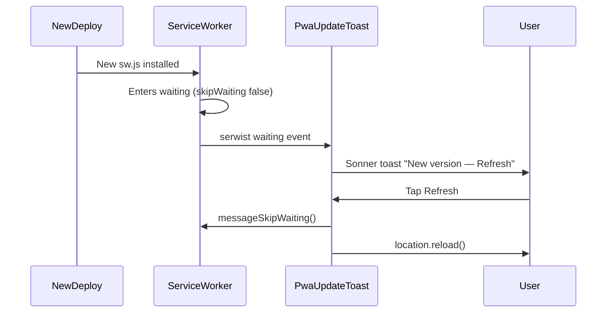

# PWA Quick Wins Plan

## Scope

Five targeted improvements to the existing PWA layer. No desktop layout changes; install banner remains `md:hidden`.

---

## 1. Broaden iOS install detection

**Problem:** [`hooks/use-pwa-install.ts`](hooks/use-pwa-install.ts) uses `isIosSafari()`, so Chrome/Firefox/Brave on iPhone never see the A2HS guide (none support `beforeinstallprompt` on iOS).

**Changes:**
- Replace `isIosSafari()` check with `isIosDevice()` for `showIosGuide` (keep `isIosDevice()` helper; remove or stop using `isIosSafari()`).
- Update [`components/pwa-ios-install-sheet.tsx`](components/pwa-ios-install-sheet.tsx) copy:
  - Title: **Install on iPhone** (unchanged)
  - Step 1: **"Share button in your browser's toolbar"** (not Safari-only)
- No changes needed to [`components/pwa-install-banner.tsx`](components/pwa-install-banner.tsx) or [`components/mobile-more-sheet.tsx`](components/mobile-more-sheet.tsx) — they already consume `showIosGuide` / `showInstallUi`.

```ts
// Before
const showIosGuide = isIosSafari() && !isStandalone && !dismissed;

// After
const showIosGuide = isIosDevice() && !isStandalone && !dismissed;
```

---

## 2. Time-limited dismiss (21 days)

**Problem:** `localStorage` key `pwa-install-dismissed` is permanent.

**Changes:**
- Add shared constants in new [`lib/pwa.ts`](lib/pwa.ts):

```ts
export const PWA_INSTALL_DISMISS_KEY = "pwa-install-dismissed-at";
export const PWA_INSTALL_DISMISS_EVENT = "pwa-install-dismissed";
export const PWA_INSTALL_DISMISS_TTL_MS = 21 * 24 * 60 * 60 * 1000; // 21 days
```

- Refactor [`hooks/use-pwa-install.ts`](hooks/use-pwa-install.ts):
  - Store **ISO timestamp** on dismiss / successful install (not `"1"`).
  - `getDismissedSnapshot()`: return `true` only if timestamp exists **and** `Date.now() - timestamp < TTL`.
  - **Migration:** if legacy key `pwa-install-dismissed === "1"` exists, treat as dismissed now (write current timestamp, remove legacy key) so existing users get a fresh 21-day window rather than instant re-prompt.
  - Successful install still dismisses (permanent until TTL — acceptable since standalone hides UI anyway).
- Update [`DEVELOPER_GUIDE.md`](DEVELOPER_GUIDE.md) PWA table: document `pwa-install-dismissed-at` + 21-day TTL.

---

## 3. Manifest `id`

**Change in [`app/manifest.ts`](app/manifest.ts):**

```ts
export default function manifest(): MetadataRoute.Manifest {
  return {
    id: "/",
    name: "Credit Spend Analyser",
    // ...
  };
}
```

Ensures Chromium treats reinstalls across deploys as the same app identity.

---

## 4. Manifest shortcuts

**Change in [`app/manifest.ts`](app/manifest.ts):**

Add `shortcuts` aligned with primary nav from [`lib/nav.ts`](lib/nav.ts):

| Name | URL | Icon |
|------|-----|------|
| Dashboard | `/` | `/icons/icon-192` |
| Upload | `/upload` | `/icons/icon-192` |
| Transactions | `/transactions` | `/icons/icon-192` |

```ts
shortcuts: [
  {
    name: "Dashboard",
    short_name: "Dashboard",
    url: "/",
    icons: [{ src: "/icons/icon-192", sizes: "192x192", type: "image/png" }],
  },
  // Upload, Transactions — same icon entry
],
```

Optional DRY: export `PWA_SHORTCUTS` from [`lib/pwa.ts`](lib/pwa.ts) and import in `manifest.ts` (keeps manifest.ts clean, avoids coupling manifest to React nav icons).

Shortcuts appear on Android/Chromium long-press; no effect on iOS (acceptable).

---

## 5. “Update available” toast

**Problem:** [`app/sw.ts`](app/sw.ts) uses `skipWaiting: true` + `clientsClaim: true`, so new service workers activate without user notice. Old JS may still run until reload.

**Approach:** User-controlled updates (recommended for a finance app):



**Changes:**

| File | Change |
|------|--------|
| [`app/sw.ts`](app/sw.ts) | Set `skipWaiting: false` (keep `clientsClaim: true`) |
| [`components/pwa-update-toast.tsx`](components/pwa-update-toast.tsx) | New client component: `useSerwist()` from `@serwist/turbopack/react`, listen for `waiting` event, show persistent Sonner toast with **Refresh** action |
| [`components/serwist-provider.tsx`](components/serwist-provider.tsx) | Mount `<PwaUpdateToast />` inside provider (only runs when SW enabled, i.e. production) |

**Toast behavior:**
- Use existing Sonner via `toast()` (same as rest of app; respects [`MobileToaster`](components/mobile-toaster.tsx) position).
- Message: **"New version available"** / **"Refresh to get the latest version."**
- Action button: calls `serwist.messageSkipWaiting()` then `window.location.reload()`.
- `duration: Infinity` (or long duration) until dismissed/refreshed.
- Guard: only one toast at a time (`useRef` flag); ignore `waiting` on first-ever install (`event.wasWaitingBeforeRegister` from Serwist types).

**Note:** SW remains **disabled in development** — update toast is testable via `npm run build && npm run start`.

---

## Files touched

| File | Action |
|------|--------|
| [`lib/pwa.ts`](lib/pwa.ts) | **Create** — dismiss TTL constants, optional shortcuts export |
| [`hooks/use-pwa-install.ts`](hooks/use-pwa-install.ts) | iOS detection + TTL dismiss |
| [`components/pwa-ios-install-sheet.tsx`](components/pwa-ios-install-sheet.tsx) | Browser-neutral copy |
| [`app/manifest.ts`](app/manifest.ts) | `id` + `shortcuts` |
| [`app/sw.ts`](app/sw.ts) | `skipWaiting: false` |
| [`components/pwa-update-toast.tsx`](components/pwa-update-toast.tsx) | **Create** — update toast |
| [`components/serwist-provider.tsx`](components/serwist-provider.tsx) | Mount update toast |
| [`DEVELOPER_GUIDE.md`](DEVELOPER_GUIDE.md) | Document TTL + update flow |

---

## Verification

- [ ] `npx tsc --noEmit` + `npm run lint` clean
- [ ] `npm run build` succeeds (Serwist still generates `/serwist/sw.js`)
- [ ] iOS Chrome user agent: `showIosGuide === true`, install banner/sheet visible
- [ ] Dismiss banner → reappears after TTL (manual test: temporarily set TTL to 1 min)
- [ ] Manifest at `/manifest.webmanifest` includes `id` and 3 shortcuts
- [ ] Production: deploy new build while tab open → toast appears; Refresh loads new version
- [ ] Desktop layout unchanged (no new desktop UI)

---

## Out of scope

- Login-page install hint, cache clear on logout, Lighthouse CI (separate follow-ups)
