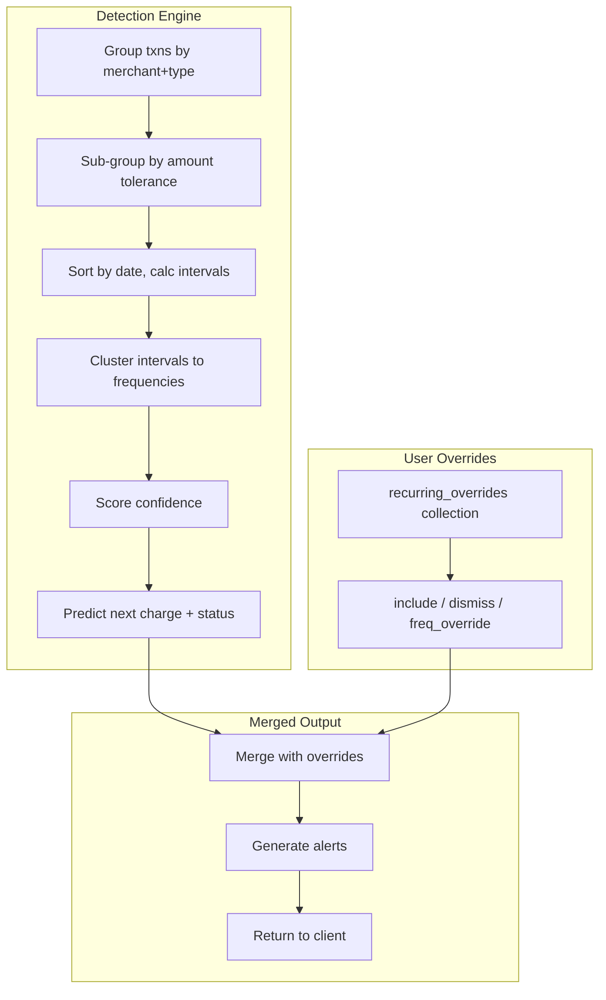

# Recurring Transactions Detection Engine

## Architecture Overview




---

## New Files


| File                                    | Responsibility                                                                           |
| --------------------------------------- | ---------------------------------------------------------------------------------------- |
| `lib/models/recurring.ts`               | Detection engine (MongoDB aggregation + JS post-processing)                              |
| `lib/services/recurring-detector.ts`    | Pure detection logic (interval clustering, confidence scoring, frequency classification) |
| `app/api/recurring/route.ts`            | GET (list detected recurring)                                                            |
| `app/api/recurring/overrides/route.ts`  | POST (add override), DELETE (remove override)                                            |
| `app/(dashboard)/recurring/page.tsx`    | Client page with summary cards, table, alerts                                            |
| `app/(dashboard)/recurring/loading.tsx` | Skeleton loader                                                                          |
| `types/index.ts`                        | New types added to existing file                                                         |


---

## 1. Types (add to `types/index.ts`)

```typescript
export type RecurringFrequency =
  | "weekly"
  | "bi-weekly"
  | "monthly"
  | "quarterly"
  | "semi-annual"
  | "annual";

export type RecurringStatus = "active" | "possibly_cancelled" | "new";

export type RecurringOverrideAction = "include" | "dismiss" | "frequency_override";

export interface RecurringOverrideDoc {
  _id: ObjectId;
  userId: ObjectId;
  merchant: string;
  type: TransactionType;
  action: RecurringOverrideAction;
  frequency?: RecurringFrequency;
  customNote?: string;
  createdAt: Date;
}

export interface RecurringItem {
  merchant: string;
  averageAmount: number;
  lastAmount: number;
  frequency: RecurringFrequency;
  confidence: number; // 0.0 - 1.0
  transactionCount: number;
  firstSeen: string; // ISO date
  lastSeen: string;
  nextExpected: string | null;
  type: TransactionType;
  category: Category;
  status: RecurringStatus;
  isVariable: boolean;
  amountStdDev: number;
  totalAnnualCost: number;
  userOverride?: RecurringOverrideAction;
}

export interface RecurringAlert {
  merchant: string;
  type: "price_increase" | "price_decrease" | "possibly_cancelled" | "new_detected" | "unusual_amount";
  message: string;
  severity: "info" | "warning";
  detectedAt: string;
}

export interface RecurringSummary {
  totalMonthlyRecurring: number;
  totalAnnualRecurring: number;
  activeCount: number;
  alerts: RecurringAlert[];
  items: RecurringItem[];
}
```

---

## 2. Detection Engine (`lib/services/recurring-detector.ts`)

Pure functions (no I/O) that take grouped transaction data and return detection results.

### Algorithm

1. **Grouping:** Group all user transactions by `(normalizedMerchant, type)`.
2. **Minimum threshold:** Discard groups with fewer than 2 transactions.
3. **Amount sub-grouping:** Within each merchant group, identify amount clusters using a 10% tolerance band. This handles both fixed subscriptions (Netflix = exact $15.49) and slight variations (tax-included charges).
4. **Interval analysis:** For each (merchant, ~amount) cluster:
  - Sort chronologically
  - Calculate day-gaps between consecutive transactions
  - Compute median interval
  - Match median against known frequency windows (with tolerance):
    - Weekly: 5-9 days
    - Bi-weekly: 12-16 days
    - Monthly: 26-35 days
    - Quarterly: 80-100 days
    - Semi-annual: 170-200 days
    - Annual: 350-380 days
5. **Variable recurring detection:** If amounts vary >10% but merchant repeats at regular intervals, flag as `isVariable: true` (utilities, rent with slight changes).
6. **Confidence scoring (0-1):**
  - Base: `min(occurrences / 4, 0.5)` (4+ hits = max base)
  - Interval consistency bonus: `(1 - coefficientOfVariation(intervals)) * 0.3`
  - Amount consistency bonus: `(1 - coefficientOfVariation(amounts)) * 0.2`
  - Capped at 1.0
7. **Status determination:**
  - `"active"`: next expected date is in the future OR within grace period past
  - `"possibly_cancelled"`: next expected date has passed by more than 1.5x the frequency interval
  - `"new"`: only 2 occurrences detected
8. **Next expected date:** `lastTransactionDate + medianInterval`
9. **Annual cost projection:** `averageAmount * frequencyMultiplier` (weekly=52, monthly=12, etc.)

### Edge cases handled

- **Grocery-store false positives:** Filtered out by high amount variance (stdDev > 40% of mean) AND no interval regularity
- **One-off repeated charges:** Requires interval consistency, not just same-amount repetition
- **Mid-subscription price changes:** Detected as alert; recurring item uses latest amount
- **Refunds that look like credits:** Only group within same `type` (debit with debit, credit with credit)
- **Multiple subscriptions to same merchant:** Amount sub-grouping separates (e.g., Spotify $9.99 personal vs $15.99 family would be two items if both appear)
- **Transactions that span card changes:** Grouping is by merchant across all cards (user-level, not card-level)

---

## 3. Data Layer (`lib/models/recurring.ts`)

### `detectRecurringTransactions(userId: string): Promise<RecurringSummary>`

- Runs a MongoDB aggregation pipeline to group transactions by `merchant` + `type`, collecting arrays of `{ date, amount }` per group
- Passes grouped data to the pure detection functions in `recurring-detector.ts`
- Merges results with user overrides from `recurring_overrides` collection
- Generates alerts by comparing detected items against expected state
- Returns the full `RecurringSummary`

### `getRecurringOverrides(userId: string): Promise<RecurringOverrideDoc[]>`

### `upsertRecurringOverride(userId: string, override: {...}): Promise<void>`

### `deleteRecurringOverride(userId: string, merchant: string, type: TransactionType): Promise<boolean>`

---

## 4. Database Changes

Add to `COLLECTIONS` in [lib/db.ts](lib/db.ts):

```typescript
export const COLLECTIONS = {
  // ...existing
  recurringOverrides: "recurring_overrides",
} as const;
```

The `recurring_overrides` collection stores user decisions (include/dismiss/frequency corrections). No new index is required beyond the default `_id`; queries filter by `userId` which should have an index.

---

## 5. API Routes

### `GET /api/recurring`

- Auth check via `getSession()`
- Calls `detectRecurringTransactions(session.userId)`
- Returns `RecurringSummary` as JSON
- Optional query params: `type` (debit/credit/all), `status` (active/possibly_cancelled/all)

### `POST /api/recurring/overrides`

- Body: `{ merchant: string, type: TransactionType, action: RecurringOverrideAction, frequency?: RecurringFrequency }`
- Validates that the merchant actually exists in user's transactions (requirement from user)
- Upserts into `recurring_overrides`

### `DELETE /api/recurring/overrides`

- Body: `{ merchant: string, type: TransactionType }`
- Removes the override, returning item to auto-detection

---

## 6. Page UI (`app/(dashboard)/recurring/page.tsx`)

### Layout

- **Alerts banner** (top) — dismissible cards for price changes, missed charges, new detections
- **Summary cards row:**
  - Monthly recurring total
  - Annual projection
  - Active subscription count
  - Possibly cancelled count
- **Recurring items table:**
  - Columns: Merchant, Amount, Frequency, Next Expected, Category, Status, Actions
  - Variable items show amount range instead of fixed amount
  - Sortable by amount, frequency, next expected
  - Filter by type (debit/credit), status, frequency
- **Actions per item:**
  - Dismiss (mark as not recurring)
  - Override frequency
  - View transaction history for this merchant (link to transactions page with merchant filter)
- **Empty state:** Guidance that recurring items appear after uploading 2+ months of statements
- **"Add recurring" button:** Opens a dialog to search existing merchants and manually mark as recurring

### Sidebar addition

Add to `NAV` in [components/app-sidebar.tsx](components/app-sidebar.tsx):

```typescript
{ href: "/recurring", label: "Recurring", icon: Repeat }
```

(`Repeat` from lucide-react)

---

## 7. Constants (add to `lib/constants.ts`)

```typescript
export const RECURRING_MIN_OCCURRENCES = 2;
export const RECURRING_AMOUNT_TOLERANCE = 0.10; // 10%
export const RECURRING_VARIABLE_THRESHOLD = 0.40; // 40% stddev = grocery, not subscription
export const RECURRING_CONFIDENCE_MIN = 0.3; // below this, don't show
export const RECURRING_GRACE_PERIOD_MULTIPLIER = 1.5; // 1.5x interval before "possibly cancelled"

export const FREQUENCY_WINDOWS: Record<RecurringFrequency, { min: number; max: number; multiplier: number }> = {
  weekly: { min: 5, max: 9, multiplier: 52 },
  "bi-weekly": { min: 12, max: 16, multiplier: 26 },
  monthly: { min: 26, max: 35, multiplier: 12 },
  quarterly: { min: 80, max: 100, multiplier: 4 },
  "semi-annual": { min: 170, max: 200, multiplier: 2 },
  annual: { min: 350, max: 380, multiplier: 1 },
};
```

---

## 8. Alert Generation Logic

Alerts are computed at query time (no background jobs):

- `**price_increase**` / `**price_decrease**`: Compare last 2 charges for same recurring item; flag if delta > 5%
- `**possibly_cancelled**`: `nextExpected` date has passed by > grace period
- `**new_detected**`: Item has exactly 2 occurrences and confidence >= threshold (first time pattern detected)
- `**unusual_amount**`: Latest charge deviates > 2 standard deviations from the item's historical mean

---

## 9. Performance Considerations

- The aggregation pipeline groups and projects only the fields needed (`merchant`, `type`, `transactionDate`, `amount`)
- For users with thousands of transactions, the grouping runs in MongoDB (efficient), and the interval math runs in Node on the reduced grouped data (typically < 200 merchant groups)
- No caching for v1; if performance becomes an issue, we can add a materialized `recurring_detected` collection refreshed on upload

---

## 10. Files Modified

- [types/index.ts](types/index.ts) — new types
- [lib/db.ts](lib/db.ts) — add `recurringOverrides` to `COLLECTIONS`
- [lib/constants.ts](lib/constants.ts) — detection constants
- [components/app-sidebar.tsx](components/app-sidebar.tsx) — new nav item
- [DEVELOPER_GUIDE.md](DEVELOPER_GUIDE.md) — update project structure tree and collections table

