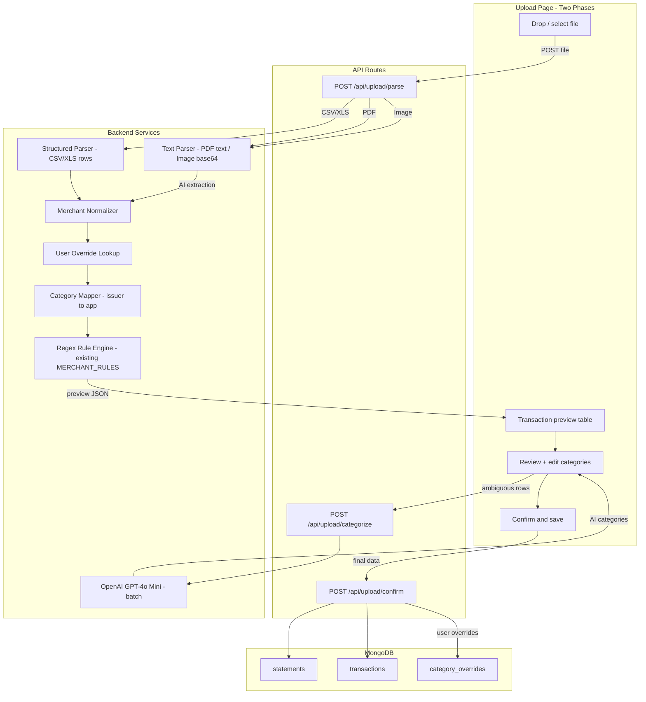

# Smart Upload Pipeline with Tiered Categorization

## Problem

The current pipeline sends **all** file formats through OpenAI for extraction, including CSVs that already contain structured, categorized data. For a Discover CSV with columns `Trans. Date, Description, Amount, Category`, this wastes money, adds 10-30 seconds of latency, and is less accurate than direct parsing. Transactions are also saved immediately with no user review.

## Architecture




## Categorization Tiers (applied in order)

Each transaction goes through these tiers. The first match wins.


| Tier | Source                              | `categorizedBy` value | Cost          | Example                                                           |
| ---- | ----------------------------------- | --------------------- | ------------- | ----------------------------------------------------------------- |
| 0    | User override from past corrections | `"user_override"`     | Free          | User previously changed "CURSOR, AI POWERED IDE" to Subscriptions |
| 1    | Issuer category direct mapping      | `"source_map"`        | Free          | Discover "Restaurants" maps to "Dining"                           |
| 2    | Regex rule on merchant name         | `"rule"`              | Free          | "AMAZON" matches Shopping rule                                    |
| 3    | AI (user-triggered, batch)          | `"ai"`                | ~$0.001/batch | Ambiguous merchants sent to GPT-4o Mini                           |
| 4    | User manual selection in review UI  | `"user"`              | Free          | User picks from dropdown                                          |


### Discover Category Mapping Table (Tier 1)


| Discover Category         | App Category   | Confidence        |
| ------------------------- | -------------- | ----------------- |
| Restaurants               | Dining         | direct            |
| Supermarkets              | Groceries      | direct            |
| Gasoline                  | Gas/Fuel       | direct            |
| Medical Services          | Healthcare     | direct            |
| Education                 | Education      | direct            |
| Payments and Credits      | Payment/Credit | direct            |
| Awards and Rebate Credits | Payment/Credit | direct            |
| Government Services       | Other          | direct            |
| Merchandise               | **ambiguous**  | falls to Tier 2/3 |
| Services                  | **ambiguous**  | falls to Tier 2/3 |
| Travel/ Entertainment     | **ambiguous**  | falls to Tier 2/3 |


---

## Data Model Changes

### `TransactionDoc` -- add two optional fields in [types/index.ts](types/index.ts)

```ts
export type CategorizationMethod = "source_map" | "rule" | "ai" | "user" | "user_override";

export interface TransactionDoc {
  // ... existing fields unchanged ...
  sourceCategory: string | null;      // Original category from issuer CSV (e.g. "Restaurants")
  categorizedBy: CategorizationMethod; // How the final category was determined
}
```

Both fields are **optional** at the DB level (old docs won't have them). Code must tolerate `undefined` gracefully per developer guide section 12.

### `ExtractedTransaction` -- add `sourceCategory`

```ts
export interface ExtractedTransaction {
  // ... existing fields ...
  sourceCategory?: string | null;
}
```

### New collection: `category_overrides`

```ts
export type CategoryOverrideDoc = {
  _id: ObjectId;
  userId: ObjectId;
  merchantNormalized: string;  // lowercase, trimmed merchant key
  category: Category;
  createdAt: Date;
};
```

When a user changes a transaction's category in the review UI, an upsert saves `{ merchantNormalized, category }`. On future uploads, Tier 0 checks this collection before any other logic. Add `COLLECTIONS.categoryOverrides = "category_overrides"` to [lib/db.ts](lib/db.ts).

---

## File Changes

### New files


| File                                  | Responsibility                                                                                                                                          |
| ------------------------------------- | ------------------------------------------------------------------------------------------------------------------------------------------------------- |
| `lib/parsers/csv-row-parser.ts`       | Parse CSV buffer into typed `StructuredRow[]` using `xlsx` `sheet_to_json`. Handle Discover's multiline descriptions, amount parsing, date parsing.     |
| `lib/services/merchant-normalizer.ts` | Strip noise from descriptions: `APPLE PAY ENDING IN XXXX`, reference numbers, `SQ *`/`TST*`/`DD *`/`IC*` prefixes, trailing state codes. Pure function. |
| `lib/services/category-mapper.ts`     | `DISCOVER_CATEGORY_MAP` constant + `mapIssuerCategory()` function. Returns `{ category, categorizedBy }` or `null` for ambiguous. Pure function.        |
| `lib/models/category-overrides.ts`    | `getOverridesForUser()`, `upsertOverride()`, `getOverrideMap()` (returns `Map<merchantNorm, Category>`).                                                |
| `app/api/upload/parse/route.ts`       | Accept file upload, return preview JSON (no DB write).                                                                                                  |
| `app/api/upload/categorize/route.ts`  | Accept array of ambiguous `{ merchant, rawDescription }`, return AI categories.                                                                         |
| `app/api/upload/confirm/route.ts`     | Accept final reviewed transactions + statement metadata, write to MongoDB.                                                                              |
| `components/upload-review-table.tsx`  | Transaction table with inline category editing (ShadCN `Select` dropdown per row), color-coded confidence badges, "AI Categorize" button.               |


### Modified files


| File                                                                       | Changes                                                                                                                                                                                                                                                                                                                                                     |
| -------------------------------------------------------------------------- | ----------------------------------------------------------------------------------------------------------------------------------------------------------------------------------------------------------------------------------------------------------------------------------------------------------------------------------------------------------- |
| [types/index.ts](types/index.ts)                                           | Add `CategorizationMethod` type, `sourceCategory` + `categorizedBy` to `TransactionDoc` and `ExtractedTransaction`, `CategoryOverrideDoc` type, `DiscoverCategory` type.                                                                                                                                                                                    |
| [lib/db.ts](lib/db.ts)                                                     | Add `categoryOverrides: "category_overrides"` to `COLLECTIONS`.                                                                                                                                                                                                                                                                                             |
| [lib/parsers/index.ts](lib/parsers/index.ts)                               | Extend `ParsedFile` with optional `structuredRows: StructuredRow[]                                                                                                                                                                                                                                                                                          |
| [lib/parsers/csv-parser.ts](lib/parsers/csv-parser.ts)                     | Keep existing `parseCsv()` for text fallback. Add `parseCsvStructured()` that returns `StructuredRow[]` using `sheet_to_json`.                                                                                                                                                                                                                              |
| [lib/services/categorizer.ts](lib/services/categorizer.ts)                 | Refactor `categorizeTransactions()` to accept an optional `overrideMap` and respect `sourceCategory`. Apply tiers in order: override lookup, source mapping, regex rules, mark remaining as `"Other"` with `categorizedBy: "rule"`. Keep the existing LLM batch function but expose it separately as `categorizeBatchWithAI()` for the categorize endpoint. |
| [lib/services/extraction-pipeline.ts](lib/services/extraction-pipeline.ts) | Split into two exported functions: `parseAndPreview()` (no DB write, returns preview) and `confirmAndSave()` (writes to DB). The existing `runExtractionPipeline()` remains as a convenience wrapper that calls both (for backward compatibility or future bulk import).                                                                                    |
| [app/(dashboard)/upload/page.tsx](app/(dashboard)/upload/page.tsx)         | Complete rewrite to a multi-step flow: Step 1 (drop file) -> Step 2 (review table) -> Step 3 (confirmed).                                                                                                                                                                                                                                                   |
| [lib/constants.ts](lib/constants.ts)                                       | Add `AI_CATEGORIZE_BATCH_SIZE = 50`.                                                                                                                                                                                                                                                                                                                        |
| [lib/models/transactions.ts](lib/models/transactions.ts)                   | `InsertTransactionInput` gains `sourceCategory` and `categorizedBy` fields.                                                                                                                                                                                                                                                                                 |
| [DEVELOPER_GUIDE.md](DEVELOPER_GUIDE.md)                                   | Update structure diagram with new files.                                                                                                                                                                                                                                                                                                                    |


---

## Detailed Implementation

### 1. Structured CSV parser: `lib/parsers/csv-row-parser.ts`

Responsibility: Convert a CSV buffer into an array of `StructuredRow` objects without AI.

```ts
export type StructuredRow = {
  transactionDate: string;     // "YYYY-MM-DD"
  description: string;         // raw description (multiline collapsed)
  amount: number;              // raw amount (negative = payment/credit)
  sourceCategory: string | null; // issuer-provided category if present
  rawFields: Record<string, string>; // all original columns for debugging
};
```

Key logic:

- Use `XLSX.read(buffer, { type: "buffer" })` then `XLSX.utils.sheet_to_json<Record<string, string>>(sheet, { raw: false })` to get row objects.
- Detect column mapping heuristically: look for headers containing `date`, `description`/`desc`, `amount`/`amt`, `category`/`cat`. This makes it work for Discover, Amex, and other issuers that export CSV.
- Parse `Trans. Date` (`MM/DD/YYYY`) to `YYYY-MM-DD`.
- Parse `Amount`: handle quoted numbers with commas (e.g. `"-1,200.98"`). Negative = payment/credit.
- Collapse multiline descriptions into a single line (replace `\n` with  ``).
- If no `Category` column exists, `sourceCategory` is `null`.

### 2. Merchant normalizer: `lib/services/merchant-normalizer.ts`

Pure function: `normalizeMerchant(rawDescription: string): string`

Strip in order:

1. Lines matching `APPLE PAY ENDING IN \d{4}` -- remove entirely
2. Lines that are purely numeric reference numbers (e.g. `0001152921516977782857`)
3. Lines matching `ITEM TRANSFERRED FROM PREV ACCOUNT`, `SECURITY DISPUTE ADJUSTMENT`
4. Known prefixes: `SQ *`, `TST*`, `DD *`, `IC*`, `IC*` , `SPO*`, `CPY*`, `EB *`, `FD *`, `REG` , `MS CM`  -- strip prefix
5. Trailing state abbreviation + optional zip:  `CA`,  `WA`,  `NY 10001` etc.
6. Trailing phone numbers: `\d{3}-\d{3}-\d{4}` or `\d{10}`
7. Trim and title-case the result

Example: `"DECCAN MORSEL SUNNYVALE SUNNYVALE CA\nAPPLE PAY ENDING IN 0729"` becomes `"Deccan Morsel Sunnyvale"`.

Also export `normalizeMerchantKey(rawDescription: string): string` -- lowercase + trimmed version used as the key for `category_overrides` lookups.

### 3. Category mapper: `lib/services/category-mapper.ts`

```ts
export const DISCOVER_CATEGORY_MAP: Record<string, Category | null> = {
  "Restaurants": "Dining",
  "Supermarkets": "Groceries",
  "Gasoline": "Gas/Fuel",
  "Medical Services": "Healthcare",
  "Education": "Education",
  "Payments and Credits": "Payment/Credit",
  "Awards and Rebate Credits": "Payment/Credit",
  "Government Services": "Other",
  // Ambiguous -- return null, fall through to regex/AI
  "Merchandise": null,
  "Services": null,
  "Travel/ Entertainment": null,
};

export function mapIssuerCategory(
  sourceCategory: string | null
): { category: Category; categorizedBy: CategorizationMethod } | null {
  if (!sourceCategory) return null;
  const mapped = DISCOVER_CATEGORY_MAP[sourceCategory];
  if (mapped) return { category: mapped, categorizedBy: "source_map" };
  return null;
}
```

This is extensible: add `AMEX_CATEGORY_MAP`, `VISA_CATEGORY_MAP` later as new card formats are supported.

### 4. Refactored categorizer: `lib/services/categorizer.ts`

The existing `categorizeTransactions()` is refactored to accept context and apply tiers:

```ts
export async function categorizeTransactions(
  txs: ExtractedTransaction[],
  opts?: { overrideMap?: Map<string, Category> },
): Promise<CategorizedTx[]>
```

For each transaction:

1. If `type` is `payment` or `credit` -> `Payment/Credit`, `categorizedBy: "rule"`
2. Check `overrideMap` using `normalizeMerchantKey()` -> if match, use it, `categorizedBy: "user_override"`
3. Call `mapIssuerCategory(tx.sourceCategory)` -> if match, use it, `categorizedBy: "source_map"`
4. Call `categorizeMerchantRule(merchant, rawDescription)` -> if match, `categorizedBy: "rule"`
5. Mark as `"Other"`, `categorizedBy: "rule"` (will be flagged as ambiguous in UI)

The AI batch call is extracted into a separate exported function:

```ts
export async function categorizeBatchWithAI(
  rows: Array<{ merchant: string; rawDescription: string }>,
): Promise<Array<{ index: number; category: Category }>>
```

This is called by `POST /api/upload/categorize`, not by the main categorizer.

### 5. Split pipeline: `lib/services/extraction-pipeline.ts`

`**parseAndPreview()**` -- parse file, detect card, extract/parse transactions, categorize (no AI, no DB write):

```ts
export interface PreviewResult {
  cardType: CardType;
  fileFormat: FileFormat;
  statementDate: Date | null;
  transactions: PreviewTransaction[];
}

export type PreviewTransaction = {
  transactionDate: string;
  postDate: string | null;
  merchant: string;
  amount: number;
  type: TransactionType;
  rawDescription: string;
  sourceCategory: string | null;
  category: Category;
  categorizedBy: CategorizationMethod;
};
```

Logic:

1. `parseFile()` -- now returns `structuredRows` for CSV/XLS.
2. If `structuredRows` is present: skip AI extraction entirely. Map rows to `ExtractedTransaction[]` directly. Detect card type from text heuristics (Discover CSVs contain "CASHBACK BONUS" etc.).
3. If `structuredRows` is null (PDF/image): use existing AI extraction path via `extractFromText` / `extractFromImage`.
4. Run through `normalizeMerchant()` for clean merchant names.
5. Run `categorizeTransactions()` with the user's override map.
6. Return preview (no DB write).

`**confirmAndSave()**` -- accept reviewed transactions, write to DB:

```ts
export async function confirmAndSave(args: {
  userId: string;
  cardType: CardType;
  fileFormat: FileFormat;
  originalFilename: string;
  statementDate: Date | null;
  transactions: PreviewTransaction[];
}): Promise<{ statementId: string; transactionCount: number; totalAmount: number }>
```

Logic:

1. Insert statement doc.
2. Insert transaction docs with `sourceCategory` and `categorizedBy`.
3. For any transaction where `categorizedBy === "user"` (user changed the category), upsert into `category_overrides`.
4. Return summary.

### 6. New API routes

`**app/api/upload/parse/route.ts**` -- `POST`

Accepts `multipart/form-data` with `file` (and optional `cardType` override). Calls `parseAndPreview()`. Returns `PreviewResult` JSON. No DB write. Follows developer guide section 13 template (top-level try/catch, auth first, `{ error: string }` shape).

`**app/api/upload/categorize/route.ts**` -- `POST`

Accepts JSON body: `{ rows: Array<{ merchant: string; rawDescription: string }> }`. Calls `categorizeBatchWithAI()`. Returns `{ results: Array<{ index: number; category: Category }> }`. This is the "AI button" backend.

`**app/api/upload/confirm/route.ts**` -- `POST`

Accepts JSON body with the full reviewed transaction list + metadata. Calls `confirmAndSave()`. Returns `{ statementId, transactionCount, totalAmount }`.

### 7. Upload page rewrite: `app/(dashboard)/upload/page.tsx`

Multi-step client component with three states:

**Step 1: File Selection** (existing dropzone, mostly unchanged)

- Drop or select file.
- On file selected: POST to `/api/upload/parse`.
- Show spinner with "Parsing statement..." (no "10-30 seconds" message for CSV -- it should be instant).
- On success: transition to Step 2.

**Step 2: Review Transactions -- Two-Section Layout**

The review screen splits transactions into two visually distinct sections:

**Section A: "Needs Attention" (top, collapsed by default if empty)**

- Contains only transactions where `category === "Other"` (uncategorized after Tiers 0-2).
- Rendered inside a Card with a warning-toned header: count badge (e.g. "23 uncategorized"), brief explanation.
- **"Auto-categorize with AI" button** in the section header. On click:
  1. Collects all rows in this section.
  2. POSTs to `/api/upload/categorize`.
  3. Shows inline spinner on the button ("Categorizing...").
  4. On response: each row that received an AI category animates out of Section A and into its correct date-sorted position in Section B. `categorizedBy` is set to `"ai"`.
  5. Rows the AI still returned "Other" for remain in Section A.
  6. Toast: "Categorized 20 of 23 transactions".
- Each row has a ShadCN `Select` dropdown for the category. When the user manually picks a category, the row moves to Section B at its date-sorted position and `categorizedBy` becomes `"user"`.
- When Section A reaches 0 items, it collapses and shows a success message: "All transactions categorized".

**Section B: "Categorized" (below Section A)**

- Contains all transactions that already have a confident category (source_map, rule, user_override, ai, user).
- Sorted by transaction date (newest first).
- Each row: date, merchant, raw description (truncated), amount, category badge (color-coded by `categorizedBy`), category `Select` dropdown (editable -- user can still change any category here; doing so sets `categorizedBy: "user"`).
- Confidence badge colors:
  - `source_map` / `user_override`: muted/default (high confidence, trusted)
  - `rule`: secondary (medium confidence)
  - `ai`: outline with a subtle accent (AI-assigned, review encouraged)
  - `user`: primary (user explicitly chose this)

**Summary bar (sticky bottom or below tables)**

- Total transactions, total spend, breakdown by categorization method (e.g. "142 mapped, 45 rules, 20 AI, 3 manual").
- **"Save to database" button**: POSTs to `/api/upload/confirm` with all transactions from both sections. Disabled while Section A has items (user must resolve all uncategorized rows first, either via AI or manual selection).

**Step 3: Confirmation**

- Success card (similar to current) with transaction count, total spend, card type.
- "View transactions" and "Upload another" buttons.

### 8. Review table component: `components/upload-review-table.tsx`

Accepts full transaction preview array + callbacks. Internally splits into two rendered sections.

Props:

```ts
type Props = {
  transactions: PreviewTransaction[];
  onCategoryChange: (index: number, category: Category) => void;
  onAICategorize: () => void;
  aiLoading: boolean;
  uncategorizedCount: number;
};
```

**Section A ("Needs Attention"):**

- ShadCN `Card` wrapping a `Table` of uncategorized rows.
- Header shows count badge + "Auto-categorize with AI" `Button` (with `Loader2` spinner when `aiLoading`).
- When `uncategorizedCount === 0`, renders a collapsed success state instead of the table.

**Section B ("Categorized"):**

- ShadCN `Table` with columns: Date, Merchant, Description, Category, Confidence, Amount.
- Category column: `Select` component with all `CATEGORIES` options. `onValueChange` calls `onCategoryChange(index, newCategory)`.
- Confidence column: `Badge` with `categorizedBy` label, color-coded per the plan.
- Responsive: on mobile, description column hides, table scrolls horizontally.
- Imports `CATEGORIES` from `@/types`, `fmtCurrency` and `fmtDate` from `@/lib/format`.

Row movement: The parent page component (`upload/page.tsx`) owns the `transactions` state array. When `onCategoryChange` fires, it updates the category + `categorizedBy` in state. The review table re-renders, and the row naturally moves between sections based on its new category value (React re-render, no animation library needed -- though a CSS `transition` on opacity can smooth it).

### 9. Update `DEVELOPER_GUIDE.md` structure diagram

Add the new files to the project tree in section 2.

---

## What Stays the Same

- **PDF and image paths**: Still go through OpenAI for extraction (they need it -- text is unstructured).
- **Card detection**: The existing `detectCardTypeFromText()` + LLM fallback works. For Discover CSVs, the text will contain "CASHBACK BONUS" which already triggers the Discover heuristic.
- **Existing transactions page, dashboard, reports**: Untouched. The new `sourceCategory` and `categorizedBy` fields are optional and backward-compatible.
- **Existing `POST /api/upload`**: Keep for backward compatibility (calls `parseAndPreview` then `confirmAndSave` in sequence with no user review). Mark as legacy in comments.

