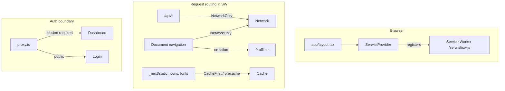

# Ultra PWA Support Plan

## Goal

Make Credit Spend Analyser **installable and native-feeling** on iPhone, Android, and desktop browsers (Chrome, Safari, Firefox, Brave, Edge), while preserving desktop parity and **never caching user financial data** in the service worker.

## Scope (explicit)

**In scope**
- Web App Manifest + app icons (192/512, maskable, Apple touch)
- Rich `metadata` / `appleWebApp` in [`app/layout.tsx`](app/layout.tsx)
- Serwist service worker: precache static shell, runtime cache for `_next/static` + fonts/images
- Network-only for `/api/*` and authenticated HTML navigations
- Dedicated offline fallback route (`/~offline`)
- Install prompt (Chromium `beforeinstallprompt`) + iOS “Add to Home Screen” guidance
- Standalone display-mode polish (status bar, theme colors, safe areas — already partially done)
- [`proxy.ts`](proxy.ts) exclusions for SW/manifest/icons
- DEVELOPER_GUIDE PWA subsection + cross-browser QA checklist

**Out of scope** (future project)
- Offline read/write of transactions, uploads, or dashboard data
- Push notifications
- Background sync for uploads

This matches the mobile plan’s former “PWA” out-of-scope item, now implemented at the **shell/install** layer only.

---

## Architecture



**Security rule (non-negotiable):** The SW must **not** store HTML from dashboard routes or any `/api/*` response. Only immutable static assets and the public offline page are precached. This prevents cross-session data leakage on shared devices.

---

## Sprint 1 — Manifest, icons, and metadata

### 1.1 App icons

Generate icons via Next.js metadata file conventions (no manual PNG design dependency):

| File | Purpose |
|------|---------|
| [`app/icon.tsx`](app/icon.tsx) | 32×32 favicon (ImageResponse) |
| [`app/apple-icon.tsx`](app/apple-icon.tsx) | 180×180 Apple touch icon |
| [`public/icons/icon-192.png`](public/icons/icon-192.png) + `icon-512.png` | Manifest icons (simple branded SVG → PNG or static assets) |
| [`public/icons/icon-maskable-512.png`](public/icons/icon-maskable-512.png) | Android adaptive icon (safe-zone padding) |

Use app primary color from [`app/globals.css`](app/globals.css) (`oklch(0.205 0 0)` ≈ `#171717` light theme) for icon background; white “chart/card” motif to match finance app identity.

### 1.2 Web App Manifest

Add [`app/manifest.ts`](app/manifest.ts) (Next.js MetadataRoute):

```ts
export default function manifest(): MetadataRoute.Manifest {
  return {
    name: "Credit Spend Analyser",
    short_name: "Spend Analyser",
    description: "Upload statements and analyze credit card spending.",
    start_url: "/",
    scope: "/",
    display: "standalone",
    orientation: "any",
    theme_color: "#171717",
    background_color: "#ffffff",
    categories: ["finance", "productivity"],
    icons: [ /* 192, 512, maskable */ ],
  };
}
```

`start_url: "/"` is correct: unauthenticated users land on login via [`proxy.ts`](proxy.ts); authenticated users reach dashboard.

### 1.3 Root layout metadata expansion

Update [`app/layout.tsx`](app/layout.tsx):

- Expand `metadata` with `applicationName`, `appleWebApp` (`capable`, `statusBarStyle: "default"`, `title`), `formatDetection: { telephone: false }`, `icons` apple touch link
- Add `themeColor` media queries for light/dark (Next.js `viewport` export supports `themeColor: [{ media: "(prefers-color-scheme: dark)", color: "..." }]`)
- Keep existing `viewportFit: "cover"` (required for iOS notch/safe-area — already set)

### 1.4 Proxy exclusions

Update [`proxy.ts`](proxy.ts) matcher to bypass auth for PWA assets:

```
/serwist/*, /manifest.webmanifest, /~offline, /icons/*
```

Also add these paths to `PUBLIC_PATHS` or ensure matcher excludes them before session check.

---

## Sprint 2 — Service worker (Serwist)

### 2.1 Dependencies

Install (production + dev per [Serwist Turbopack docs](https://serwist.pages.dev/docs/next/turbo)):

- `serwist`
- `@serwist/turbopack` (or `@serwist/next` configurator mode if production build uses webpack — verify during implementation with `next build`)

Update [`next.config.ts`](next.config.ts):

```ts
serverExternalPackages: ["esbuild-wasm"], // if using @serwist/turbopack
```

### 2.2 Service worker source

| File | Role |
|------|------|
| [`app/sw.ts`](app/sw.ts) | SW logic: precache manifest injection, custom runtime rules |
| [`app/serwist/[path]/route.ts`](app/serwist/[path]/route.ts) | `createSerwistRoute({ swSrc: "app/sw.ts", additionalPrecacheEntries: [{ url: "/~offline", revision }] })` |

**Custom caching in `app/sw.ts`** (do **not** use stock `defaultCache` wholesale):

- **Precache:** `_next/static/*`, manifest, icons, `/~offline`
- **Runtime — static assets:** `StaleWhileRevalidate` for `_next/static`, fonts, `/icons/*`
- **Runtime — API:** `NetworkOnly` for `/api/*`
- **Runtime — navigation:** `NetworkOnly` with Serwist `fallbacks` → `/~offline` on document request failure
- **Denylist precache:** all dashboard HTML routes (Serwist configurator: `precachePrerendered: false` or explicit allowlist)

### 2.3 SW registration wrapper

| File | Role |
|------|------|
| [`components/serwist-provider.tsx`](components/serwist-provider.tsx) | `"use client"` re-export of `SerwistProvider` from `@serwist/turbopack/react`, `swUrl="/serwist/sw.js"`, `disable={process.env.NODE_ENV === "development"}` optional |
| [`app/layout.tsx`](app/layout.tsx) | Wrap children with `SerwistProvider` |

Disable SW in dev initially to avoid stale-cache confusion during development; enable in production builds.

### 2.4 Offline fallback page

Add [`app/~offline/page.tsx`](app/~offline/page.tsx) — public, minimal UI:

- “You’re offline” message
- Retry button (`window.location.reload()`)
- Link to login (in case user opens installed app without session)
- Uses existing ShadCN Card/Button; mobile-safe padding (`pb-safe`)
- Add matching [`app/~offline/loading.tsx`](app/~offline/loading.tsx) if needed (optional skeleton)

Route must be **public** in `proxy.ts` (no auth redirect when offline).

---

## Sprint 3 — Install UX and standalone polish

### 3.1 Install hook + banner

| File | Role |
|------|------|
| [`hooks/use-pwa-install.ts`](hooks/use-pwa-install.ts) | Capture `beforeinstallprompt`, expose `canInstall`, `promptInstall()`, detect `display-mode: standalone` |
| [`components/pwa-install-banner.tsx`](components/pwa-install-banner.tsx) | Dismissible banner on mobile dashboard; Chromium shows “Install app” button |
| [`components/pwa-ios-install-sheet.tsx`](components/pwa-ios-install-sheet.tsx) | Step-by-step Share → Add to Home Screen for Safari iOS (no `beforeinstallprompt`) |

Mount banner in [`app/(dashboard)/layout.tsx`](app/(dashboard)/layout.tsx) with `md:hidden` — desktop users already have browser install in URL bar; don’t clutter desktop.

Persist dismiss state in `localStorage` key like `pwa-install-dismissed`.

### 3.2 Standalone detection

Add [`hooks/use-standalone.ts`](hooks/use-standalone.ts) using `matchMedia("(display-mode: standalone)")` + `navigator.standalone` (iOS) via `useSyncExternalStore` (same pattern as [`hooks/use-mobile.ts`](hooks/use-mobile.ts)).

When standalone:
- Hide install banner
- Optionally tighten [`components/mobile-page-header.tsx`](components/mobile-page-header.tsx) top padding (verify safe-area already handled)

### 3.3 More sheet entry point

Add “Install app” row in [`components/mobile-more-sheet.tsx`](components/mobile-more-sheet.tsx):

- iOS Safari → open iOS install sheet
- Chromium → trigger `promptInstall()`
- Already installed → hide row

---

## Sprint 4 — QA, docs, and acceptance

### 4.1 Cross-browser test matrix

| Platform | Browser | Checks |
|----------|---------|--------|
| iPhone | Safari | Add to Home Screen, standalone launch, safe areas, no URL bar |
| iPhone | Chrome | Install prompt or A2HS fallback |
| Android | Chrome | Install prompt, standalone, theme color |
| Android | Firefox | Manifest served, SW registers, offline page |
| Desktop | Chrome / Brave / Edge | Install from omnibox, standalone window |
| Desktop | Firefox | Manifest + SW (install UI varies) |
| Desktop | Safari macOS | Dock pin / Add to Dock |

**Lighthouse PWA audit** (Chrome DevTools): aim for installable + configured splash/icons. “Works offline” passes via `/~offline` fallback, not data pages.

**Desktop regression:** Confirm dashboard scroll, sidebar, tables, dialogs unchanged at ≥1280px (Hard rule from mobile plan).

### 4.2 DEVELOPER_GUIDE update

Add subsection under §15 or new §22 **PWA conventions**:

- Manifest/icon file locations
- SW security rules (no API/HTML cache)
- `proxy.ts` public paths for PWA assets
- When to disable SW in dev
- Install UX components
- HTTPS requirement for production

Update project structure tree with new files.

### 4.3 Acceptance criteria

- [ ] Lighthouse “Installable” passes on production build (or `next start` over HTTPS/localhost)
- [ ] iOS A2HS launches in standalone with correct icon and title
- [ ] Android/Chromium install prompt works
- [ ] Offline: navigating while offline shows `/~offline`, not stale dashboard
- [ ] `/api/*` never served from SW cache (verify in DevTools → Application → Cache Storage)
- [ ] `proxy.ts` does not block `/serwist/sw.js` or manifest
- [ ] Desktop layout unchanged
- [ ] `tsc` + `eslint` clean

---

## Key files touched

| Area | Files |
|------|-------|
| Manifest/icons | `app/manifest.ts`, `app/icon.tsx`, `app/apple-icon.tsx`, `public/icons/*` |
| SW | `app/sw.ts`, `app/serwist/[path]/route.ts`, `components/serwist-provider.tsx` |
| Offline | `app/~offline/page.tsx` |
| Install UX | `hooks/use-pwa-install.ts`, `hooks/use-standalone.ts`, `components/pwa-install-banner.tsx`, `components/pwa-ios-install-sheet.tsx` |
| Integration | `app/layout.tsx`, `app/(dashboard)/layout.tsx`, `components/mobile-more-sheet.tsx`, `proxy.ts`, `next.config.ts` |
| Docs | `DEVELOPER_GUIDE.md` |

---

## Risks and mitigations

| Risk | Mitigation |
|------|------------|
| SW caches authenticated HTML | NetworkOnly for navigations; no `precachePrerendered` for dashboard |
| Stale assets after deploy | Serwist `revision` from git/build id busts precache |
| iOS has no install prompt API | Dedicated A2HS instruction sheet |
| Serwist + Next 16 compatibility | Prefer `@serwist/turbopack`; fall back to configurator `@serwist/next` if build fails |
| Dark mode theme_color | Media-query `themeColor` in viewport export |

---

## Implementation order

1. Manifest + icons + metadata (no SW yet — immediately improves A2HS)
2. Offline page + proxy public paths
3. Serwist SW with secure caching rules
4. SerwistProvider wiring
5. Install UX components
6. QA matrix + DEVELOPER_GUIDE

After plan approval, execution proceeds sprint-by-sprint with `tsc`/`lint` after each sprint.
