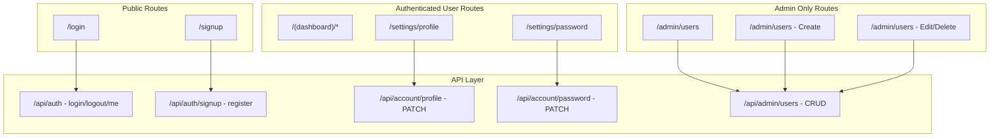

# User Account Management System

## Architecture Overview




## Data Model Changes

Extend `UserDoc` in [types/index.ts](types/index.ts):

```typescript
export type UserRole = "admin" | "user";

export interface UserDoc {
  _id: ObjectId;
  username: string;
  email?: string;
  displayName?: string;
  passwordHash: string;
  role: UserRole;
  createdAt: Date;
  updatedAt?: Date;
  lastLoginAt?: Date;
}
```

Extend `SessionPayload` to include role:

```typescript
export interface SessionPayload {
  userId: string;
  username: string;
  role: UserRole;
}
```

## Key Design Decisions

- **Roles**: Two roles — `admin` and `user`. Admins can manage all users; regular users can only manage their own profile/password.
- **First admin**: The existing `seed-user.ts` script gains a `--role admin` flag. Existing users without a `role` field default to `"user"` at read time.
- **Signup**: Public registration creates users with role `"user"`. No email verification (keeping it simple with MongoDB-only), but duplicate username/email is rejected.
- **Session**: The JWT payload gets `role` added; existing sessions without `role` are treated as `"user"` for backward compat.
- **Admin guard**: A new `requireAdmin()` helper wraps `getSession()` and returns 403 if role is not admin.
- **Data isolation**: Already in place — all collections filter by `userId`. Admin users see only their own data in the main dashboard (admin dashboard is separate for user management only).
- **Cascading delete**: When an admin deletes a user, all their data (statements, transactions, category_overrides, recurring_overrides) is also deleted.

## Implementation Breakdown

### 1. Schema and Model Layer

- Add `UserRole` type and `email`, `displayName`, `role`, `updatedAt`, `lastLoginAt` fields to `UserDoc`
- Update [lib/models/users.ts](lib/models/users.ts):
  - `createUser()` — accept optional `role`, `email`, `displayName`; default role to `"user"`
  - `updateUserProfile(userId, { displayName, email })` — new
  - `changePassword(userId, newPasswordHash)` — new
  - `deleteUser(userId)` — new, cascades to all user data
  - `listUsers()` — new, admin-only (paginated)
  - `updateLastLogin(userId)` — new
- Add unique index on `email` (sparse, since it's optional) and on `username`

### 2. Auth Layer Updates

- [lib/auth.ts](lib/auth.ts): Include `role` in `SessionPayload`; add `requireAdmin()` helper
- Update `POST /api/auth` to store `role` in token and update `lastLoginAt`
- Handle migration: users without `role` field get `"user"` at query time

### 3. New API Routes


| Route                   | Method | Access        | Purpose                                         |
| ----------------------- | ------ | ------------- | ----------------------------------------------- |
| `/api/auth/signup`      | POST   | Public        | Self-registration                               |
| `/api/account/profile`  | PATCH  | Authenticated | Update own displayName/email                    |
| `/api/account/password` | PATCH  | Authenticated | Change own password (requires current password) |
| `/api/admin/users`      | GET    | Admin         | List all users (paginated)                      |
| `/api/admin/users`      | POST   | Admin         | Create a user with any role                     |
| `/api/admin/users/[id]` | GET    | Admin         | Get single user details                         |
| `/api/admin/users/[id]` | PATCH  | Admin         | Update user role/profile                        |
| `/api/admin/users/[id]` | DELETE | Admin         | Delete user + cascade data                      |


### 4. UI Pages

- `**/signup`** — Registration form (username, email optional, password, confirm password) under `app/(auth)/signup/page.tsx`
- `**/settings/profile**` — Edit display name and email, under a new `app/(dashboard)/settings/` route group
- `**/settings/password**` — Change password form (current + new + confirm)
- `**/admin/users**` — Table of all users with role badges, create/edit/delete actions; under `app/(dashboard)/admin/users/page.tsx`
- **Navigation** — Add "Settings" link for all users; add "Admin" link visible only to admins in the sidebar/nav

### 5. Seed Script Update

Update [scripts/seed-user.ts](scripts/seed-user.ts) to accept `--role admin|user` flag (default: `admin` for the seed script since it's used for bootstrapping).

### 6. MongoDB Indexes

```typescript
// In a setup/migration script or on app boot
db.collection("users").createIndex({ username: 1 }, { unique: true });
db.collection("users").createIndex({ email: 1 }, { unique: true, sparse: true });
```

## Security Considerations

- Password change requires current password (prevents session hijack escalation)
- Admin cannot delete themselves (prevents lockout)
- Rate limiting on signup/login is out of scope for now but noted as future work
- Self-signup can be toggled via env var `ALLOW_SIGNUP=true|false` (defaults to true)

