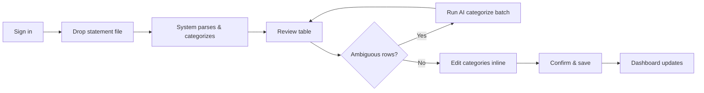

# Product Requirements Document  
## Credit Spend Analyser

| | |
|---|---|
| **Product** | Credit Spend Analyser |
| **Version** | 1.0 (Shipped) |
| **Author** | [Your Name] |
| **Status** | Live — personal finance analytics platform |
| **Last updated** | June 2026 |

---

## Executive summary

**Credit Spend Analyser** is a full-stack web application that turns messy credit card statements into actionable spending intelligence. Users upload statements in whatever format their bank provides—PDF, spreadsheet, or even a photo—and the product extracts transactions, normalizes merchants, categorizes spend across a unified taxonomy, and surfaces insights on a personal dashboard.

The product was built to solve a real gap: most people hold multiple cards from different issuers, each with its own export format and category labels. Manual spreadsheet work is tedious, error-prone, and doesn’t scale. This app automates ingestion while keeping the human in control—review before save, correct categories once, and the system learns for next time.

**Why it matters as a product:** It combines document understanding, cost-conscious AI orchestration, a learning categorization engine, and analytics UX in one cohesive experience—not a demo script, but an end-to-end system with auth, persistence, exports, and quality workflows.

---

## Problem statement

### The pain

| Pain point | User impact |
|------------|-------------|
| **Fragmented data** | Visa, Discover, Amex, and Chase each export differently; there is no single view of “where did my money go?” |
| **Inconsistent categories** | Issuer labels (“Merchandise”, “Services”) don’t map to how people budget (“Groceries”, “Subscriptions”) |
| **High friction** | Copy-pasting from PDFs or reconciling CSVs in Excel takes hours and breaks every new statement cycle |
| **Low trust in automation** | Black-box categorization without review leads to wrong insights and abandoned tools |
| **No memory** | Fixing “CURSOR” once should fix it forever; most tools don’t learn from corrections |

### Opportunity

Personal finance is a recurring job-to-be-done: **ingest → understand → decide**. Existing apps often require bank linking (privacy concern) or manual entry. Statement-upload workflows respect user data ownership while still delivering automation—if extraction and categorization are reliable enough to trust after review.

### Product hypothesis

> If users can upload any statement format, review categorized transactions in one place, and see unified insights across cards, they will replace ad-hoc spreadsheets with this tool for monthly spend review.

---

## Target users

### Primary persona: **The Multi-Card Budgeter**

- **Who:** Young professional or student managing 2–4 credit cards (e.g. Visa, Discover IT, Amex BCP, Chase Sapphire)
- **Behavior:** Downloads statements monthly; cares about category totals, subscription creep, and month-over-month trends
- **Goals:** One dashboard for all cards; minimal manual cleanup; export for taxes or sharing with a partner
- **Frustrations:** Issuer portals don’t aggregate; Mint/YNAB-style apps feel invasive or mis-categorize

### Secondary persona: **The Privacy-Conscious Analyst**

- **Who:** Technically comfortable user who refuses bank aggregation APIs
- **Behavior:** Uploads CSV/PDF locally; wants control over what is stored and how AI is used
- **Goals:** Self-hosted or personal-instance deployment; transparent categorization sources

---

## Product vision & goals

### Vision

*Make every credit card statement as easy to analyze as a well-structured spreadsheet—without building the spreadsheet.*

### North-star metric

**Time from upload to trusted insight** — measured as: upload → review → confirm → dashboard visible with correct category breakdown.

### Product goals (v1)

| # | Goal | Success signal |
|---|------|----------------|
| G1 | **Universal ingest** | PDF, CSV, XLS/XLSX, and image statements parse successfully for supported issuers |
| G2 | **Trust through review** | No transactions persist until user confirms the upload preview |
| G3 | **Accurate categories** | Majority of rows categorized without AI; ambiguous rows resolved in review or audit |
| G4 | **Cross-card clarity** | Dashboard compares spend by card, category, merchant, and month |
| G5 | **Learn once, apply forever** | Merchant-level corrections propagate to future uploads |
| G6 | **Actionable output** | Filtered CSV/PDF export for external workflows |

---

## User journeys

### Journey 1: Monthly statement upload (happy path)



1. User signs in to their private instance.
2. On **Upload**, they drag a Discover CSV (or Chase PDF, Amex image, etc.).
3. System detects card type, extracts rows, applies tiered categorization, and shows a **preview table** with source badges (issuer map, rule, override, AI, manual).
4. User fixes any miscategorized merchants; bulk propagation updates all matching rows in the preview.
5. User optionally triggers **AI categorize** for remaining “Other” debits (batched, user-initiated—cost control).
6. User **confirms**; statement and transactions persist; overrides are saved for future uploads.
7. **Dashboard** reflects new data: category donut, monthly trend, card comparison, top merchants, MoM delta.

### Journey 2: Quality check on historical data

1. User opens **Transactions**, filters by card or category.
2. They launch **Category Audit**—a sampled review of transactions prioritized by never-audited or stale-audit rows.
3. AI suggests whether each categorization looks correct; user accepts, reassigns, or skips.
4. Accepted corrections upsert **merchant overrides** and update stored transactions—improving both history and future ingest.

### Journey 3: Export for external use

1. User opens **Reports**, sets date range, card, and category filters.
2. Downloads **CSV** or **PDF** (up to 10k rows) for tax prep, partner review, or archival.
3. **Upload history** shows per-statement categorization stats (how many rows used rules vs AI vs overrides).

---

## Functional requirements

### FR-1: Authentication & access

| ID | Requirement | Priority |
|----|-------------|----------|
| FR-1.1 | Username/password login with bcrypt-hashed credentials | P0 |
| FR-1.2 | JWT session cookie (7-day TTL), HTTP-only | P0 |
| FR-1.3 | All dashboard and API routes guarded; unauthenticated users redirected to login | P0 |
| FR-1.4 | CLI seed script for initial user creation | P1 |

### FR-2: Statement upload & extraction

| ID | Requirement | Priority |
|----|-------------|----------|
| FR-2.1 | Accept PDF, CSV, XLS/XLSX, JPG/PNG up to 20 MB | P0 |
| FR-2.2 | Two-phase upload: **parse/preview** (no DB write) then **confirm** (persist) | P0 |
| FR-2.3 | Auto-detect card type via rules; LLM fallback when ambiguous | P0 |
| FR-2.4 | Structured files (CSV/XLS): deterministic row parsing via issuer-specific adapters | P0 |
| FR-2.5 | Unstructured files (PDF text, images): GPT-4o Mini extraction with structured JSON + vision for images | P0 |
| FR-2.6 | Manual card-type override on upload when detection is wrong | P1 |
| FR-2.7 | Supported issuers (v1): Visa (generic), Discover IT Student, Amex Blue Cash Preferred, Chase Sapphire Preferred | P0 |

### FR-3: Categorization engine

| ID | Requirement | Priority |
|----|-------------|----------|
| FR-3.1 | Unified taxonomy of 20 categories (Groceries, Dining, Subscriptions, Rent, etc.) | P0 |
| FR-3.2 | Tiered categorization (first match wins): user override → issuer map → regex rules → AI (on demand) → manual in UI | P0 |
| FR-3.3 | Issuer category strings mapped to app categories per card type | P0 |
| FR-3.4 | Ambiguous issuer labels (e.g. Discover “Merchandise”) fall through to rules/AI | P0 |
| FR-3.5 | `categorizedBy` metadata stored per transaction for transparency | P0 |
| FR-3.6 | AI categorization batched (50 rows), user-triggered only | P0 |
| FR-3.7 | Merchant normalization for consistent display and override keys | P0 |

### FR-4: Review & learning

| ID | Requirement | Priority |
|----|-------------|----------|
| FR-4.1 | Preview table: edit category per row before confirm | P0 |
| FR-4.2 | Bulk correction: changing one merchant updates all matching rows in preview | P0 |
| FR-4.3 | On confirm, persist category overrides for merchants user corrected | P0 |
| FR-4.4 | Transactions page: edit single transaction or all matching merchant (retroactive) | P0 |
| FR-4.5 | Upload history with categorization breakdown and safe delete (keeps overrides) | P1 |

### FR-5: Category audit (quality assurance)

| ID | Requirement | Priority |
|----|-------------|----------|
| FR-5.1 | Sample 25/50/100 debit transactions (exclude Payment/Credit) | P1 |
| FR-5.2 | Prioritize never-audited, then least-recently-audited | P1 |
| FR-5.3 | AI-assisted review with accept / reassign / skip | P1 |
| FR-5.4 | Resolutions update transactions and merchant overrides | P1 |

### FR-6: Dashboard & insights

| ID | Requirement | Priority |
|----|-------------|----------|
| FR-6.1 | Summary KPIs: total spend, transaction count, top category, month-over-month % | P0 |
| FR-6.2 | Charts: category breakdown, monthly trend, spend by card, top merchants | P0 |
| FR-6.3 | Filters: time range (e.g. 12m), card type | P0 |
| FR-6.4 | Recent transactions list with category badges | P0 |
| FR-6.5 | Empty state guiding user to first upload | P1 |

### FR-7: Transactions & reports

| ID | Requirement | Priority |
|----|-------------|----------|
| FR-7.1 | Paginated transaction list with search, card, and category filters | P0 |
| FR-7.2 | Statement history on Reports page | P0 |
| FR-7.3 | Export CSV/PDF with date, card, and category filters (max 10k rows) | P0 |

---

## Non-functional requirements

| Area | Requirement |
|------|-------------|
| **Performance** | Structured CSV ingest avoids LLM for extraction (fast, cheap); AI only for PDF/image extraction and on-demand categorization |
| **Cost control** | Rules and issuer maps handle majority of rows; GPT used in batches and only when user requests |
| **Security** | Passwords hashed; sessions signed; per-user data isolation in MongoDB queries |
| **Reliability** | Parse failures return clear errors; confirm is idempotent per user action |
| **Accessibility** | ShadCN UI components; light/dark theme support |
| **Maintainability** | Issuer adapters and category maps isolated for adding new cards without rewriting core pipeline |
| **Deployability** | Documented Netlify constraints (payload size, function timeout) with mitigation paths |

---

## System design (product view)

High-level architecture for stakeholders who want to see how the pieces connect:

```mermaid
flowchart TB
  subgraph client [Web App - Next.js]
    UI[Dashboard / Upload / Transactions / Reports]
  end

  subgraph api [API Layer]
    Auth[/api/auth]
    Parse[/api/upload/parse]
    Cat[/api/upload/categorize]
    Confirm[/api/upload/confirm]
    Insights[/api/insights]
    Export[/api/export]
    Audit[/api/transactions/audit]
  end

  subgraph intelligence [Intelligence Layer]
    Parsers[PDF / CSV / XLS / Image parsers]
    Detect[Card detector - rules + LLM]
    Extract[GPT-4o Mini extraction]
    Categorize[Tiered categorizer]
    Overrides[Merchant override store]
  end

  subgraph data [Data Layer]
    Mongo[(MongoDB)]
  end

  UI --> api
  Parse --> Parsers --> Detect --> Extract
  Parse --> Categorize --> Overrides
  Confirm --> Mongo
  Insights --> Mongo
  Export --> Mongo
```

### Data model (conceptual)

- **Users** — credentials and ownership boundary  
- **Statements** — one record per uploaded file (card, format, date, totals, upload stats)  
- **Transactions** — normalized line items linked to statement and user  
- **Category overrides** — merchant key → category (issuer-agnostic learning)

---

## Key product decisions & rationale

| Decision | Alternatives considered | Why this choice |
|----------|-------------------------|-----------------|
| **Upload-first vs bank link** | Plaid / open banking | Privacy, no third-party dependency, works with any issuer that exports statements |
| **Preview before persist** | Auto-save on upload | Builds trust; prevents bad AI extractions from polluting analytics |
| **Tiered categorization** | AI-only | Cost, speed, and explainability; most rows resolved free via issuer data and rules |
| **User-triggered AI batches** | Auto-run on every ambiguous row | Predictable API cost; user decides when “good enough” isn’t enough |
| **Merchant-level learning** | Per-transaction only | Matches mental model (“always categorize Amazon as Shopping”) |
| **Issuer adapters** | One-size-fits-all CSV parser | Chase vs Discover use different column semantics and sign conventions |
| **Category audit** | Hope users fix in upload only | Historical data drifts; sampling makes QA feasible at scale |

---

## Metrics & analytics (recommended)

For a portfolio or live deployment, these would validate product-market fit:

| Metric | Definition | Target (illustrative) |
|--------|------------|------------------------|
| **Upload completion rate** | % of parses that reach confirm | > 80% |
| **Manual edit rate** | % of rows changed in preview | < 15% after 3 months of overrides |
| **AI categorize usage** | % of uploads that invoke AI batch | Decreasing over time (learning working) |
| **Categorization mix** | % by `source_map` / `rule` / `override` / `ai` | > 70% non-AI |
| **Return usage** | Uploads per user per month | ≥ 1 (monthly habit) |
| **Time to insight** | Upload start → dashboard view | < 5 min median |

---

## Out of scope (v1)

- Multi-user households / shared accounts  
- Bank feed / Plaid integration  
- Budget targets, alerts, or bill pay  
- Mobile-native app  
- Real-time collaboration  
- Public SaaS onboarding (single-tenant / self-seeded users)

---

## Roadmap (future)

| Phase | Theme | Examples |
|-------|-------|----------|
| **v1.1** | Issuer expansion | Capital One, Citi via adapter pattern; skill-driven issuer onboarding |
| **v1.2** | Deploy hardening | Netlify chunk upload for large PDFs; function timeout tuning |
| **v2** | Budgeting layer | Category budgets, variance alerts, recurring charge detection |
| **v2** | Intelligence | “Subscription creep” insight, duplicate charge detection |
| **v3** | Collaboration | Read-only share links for exports; household view |

---

## Risks & mitigations

| Risk | Impact | Mitigation |
|------|--------|------------|
| AI extraction errors on PDFs | Wrong amounts/dates | Mandatory review step; raw description preserved |
| API cost spikes | Bill shock | Tiered categorization; batch-only AI; user-triggered |
| New issuer format breaks parser | Failed upload | Card override; extensible adapters; clear error messages |
| Serverless payload limits | 413 on large files | Documented 4.5 MB deploy cap; future chunked upload |
| Category taxonomy gaps | “Other” bucket bloat | 20-category taxonomy; audit workflow; user overrides |

---

## Launch criteria (v1 — met)

- [x] End-to-end flow: login → upload → review → confirm → dashboard  
- [x] At least 4 card types with detection and parsing paths  
- [x] Hybrid categorization with visible `categorizedBy` provenance  
- [x] Merchant override learning across uploads  
- [x] Dashboard insights with filtering and MoM  
- [x] CSV/PDF export  
- [x] Category audit workflow  
- [x] Production build passes; deployment guide documented  

---

## Tech stack summary (for portfolio context)

| Layer | Technology |
|-------|------------|
| Frontend | Next.js 16 (App Router), React, ShadCN UI, Tailwind CSS v4, Recharts |
| Backend | Next.js API routes, TypeScript strict mode |
| Database | MongoDB (native driver) |
| AI | OpenAI GPT-4o Mini (extraction, categorization, audit, vision) |
| Auth | bcrypt + jose JWT |
| Parsing | pdf-parse, xlsx, custom CSV row logic, GPT vision for images |
| Export | jsPDF + autotable |

---

## Appendix: Supported categories

Groceries · Dining · Gas/Fuel · Entertainment · Shopping · Travel · Subscriptions · Utilities · Healthcare · Insurance · Education · Personal Care · Home · Rent · Phone/Internet · Government · Transportation · Fees/Interest · Payment/Credit · Other

---

*This document describes a shipped product built as a solo end-to-end initiative: product definition, UX, backend pipeline, AI integration, data model, and deployment considerations. Replace **[Your Name]** and add a live demo URL or screenshots when publishing to your portfolio.*
